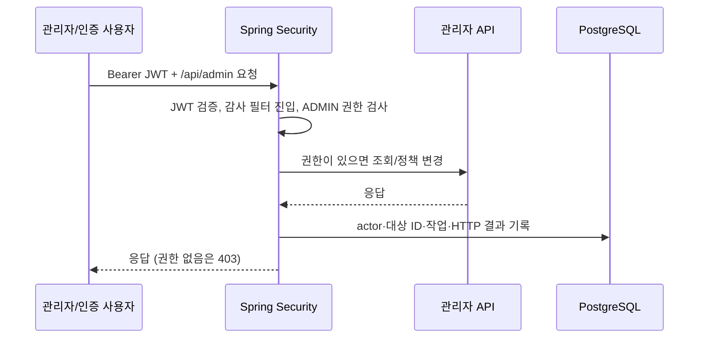
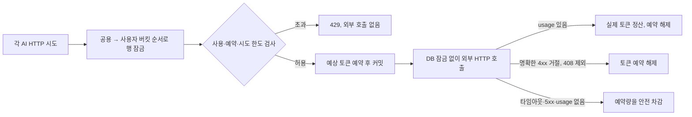
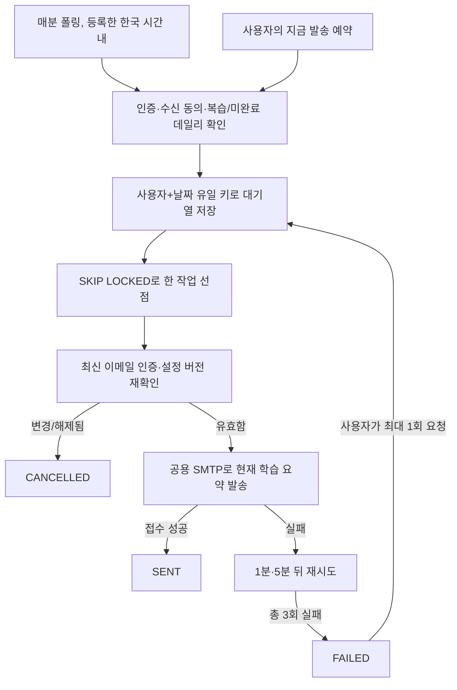

# 사용자별 AI 정책·학습 알림·관리자 감사

## 목적과 범위

다중 사용자 학습 서비스에서 관리자 열람을 추적하고, 특정 사용자의 AI 호출이 공용 예산을 소진하지 않도록 제어하며, 본인이 인증한 이메일로 복습·데일리 학습을 안내합니다. 오픈소스컨설팅 공고의 인증/권한·외부 시스템 연동·RDBMS 동시성 요구와 실제 서비스의 필요를 연결한 **osc 추가 구현 2차**입니다.

새 메시지 브로커나 Redis는 추가하지 않았습니다. 현재 저용량에서는 PostgreSQL의 행 잠금·유일 제약·영속 발송 대기열과 Spring Mail로 충분합니다. 트래픽·지연 증거가 생겼을 때 분산 캐시나 브로커를 검토합니다.

## 1. 관리자 감사 로그



- `admin_audit_log`에는 호출자 ID, 대상 사용자 ID, 정규화된 HTTP 작업/경로, 응답 상태와 시각만 저장합니다.
- 사용자 필터·풀이 상세·사용자별 AI 한도 경로에서 대상을 식별합니다. 전체 조회는 대상 NULL입니다.
- 관리자 목록뿐 아니라 ADMIN이 아닌 JWT 사용자의 관리자 API 접근 시도(403)도 기록합니다. 미인증 요청은 신뢰할 사용자 ID가 없어 기록하지 않습니다.
- 이메일·JWT·비밀번호·문항 본문·답안·요청 본문·쿼리 문자열은 감사 데이터에 저장하지 않습니다.
- 전체 관리자 → **관리자 감사 로그**에서 조회하고 사용자별 필터를 적용합니다. 감사 조회 자체도 기록됩니다.
- 감사 저장은 별도 트랜잭션입니다. DB 오류 시 개인정보 없는 오류 메시지를 서버 로그에 남깁니다. 현재는 응답을 막지 않는 best-effort이며, 금융권 수준의 fail-closed 감사·변조 방지·보존/삭제 정책은 후속 과제입니다.

## 2. 사용자별 AI 토큰 예산과 API 시도 제한

기본 정책은 사용자당 하루 **20,000 토큰·100 API 시도**, 프로젝트 공용 **50,000 토큰**입니다. 한 번의 문제 생성에서 재생성·임베딩이 여러 번 일어나면 각각의 실제 API 시도를 계산합니다. 성공 여부와 무관하게 시작한 시도는 횟수에서 되돌리지 않습니다. 시스템 자동 생성은 사용자 한도 대신 공용 예산을 사용합니다. `0` 한도는 신규 호출 차단입니다.



- `app_user.ai_daily_token_limit`, `ai_daily_call_limit`: 관리자 설정.
- `ai_budget_bucket`: 날짜·GLOBAL/USER 범위별 실제/안전 차감 토큰, 처리 중 예약, 시작 횟수.
- `ai_budget_reservation`: UUID별 예약량, 정산/해제 상태와 확인된 실제 토큰.
- 처음 버킷을 만들 때 해당 날짜의 기존 AI 원장을 반영하고, 이후에는 예약·정산으로 갱신합니다.
- `SELECT … FOR UPDATE`와 짧은 `REQUIRES_NEW` 트랜잭션으로 동시 요청이 같은 잔여량을 각각 소비하지 않게 합니다. 전역→사용자 순서로 잠가 교착 위험을 줄입니다.
- 입력은 전체 요청의 UTF-8 바이트 길이 + 1,024 토큰 여유 + 출력 상한으로 보수적으로 예약합니다. 이전 문자 수/4 방식은 실 호출의 경쟁 제어에 사용하지 않습니다.
- 퀴즈·로드맵·품질 평가·데일리 해설·임베딩에 적용하며 재시도마다 별도로 예약합니다.
- 응답 이후 문항 파싱이 실패해도 이미 발생한 사용량은 정산 상태에 남깁니다. 사용량 미확인/서버 오류는 무료로 가정하지 않습니다.
- 프로세스가 예약 뒤 종료되면 그날의 미정산 예약은 유지합니다. 자동 만료로 풀어 비용을 과소평가하지 않습니다. 다음 날짜에는 새 버킷을 사용합니다. 미정산 사고의 관리 도구는 후속 범위입니다.
- **계정·알림**에서 개인 사용/예약/한도를 확인하고 **전체 관리자 → 사용자별 AI 한도**에서 수정합니다. 한도를 낮춰도 기존 사용량과 예약을 지우지 않습니다.
- 관리자만 `PUT /api/admin/users/{id}/ai-budget`를 사용할 수 있고 변경 작업은 감사됩니다.

이는 애플리케이션의 안전 정책이지 OpenAI 청구 한도·무료 토큰 보장·정확한 과금액 계산은 아닙니다. 측정 원장과 안전 차감 버킷은 의미가 다르며, 외부에서 같은 API 키로 호출한 비용은 이 버킷에 들어오지 않습니다. 날짜는 로컬 운영의 한국 시간 기준을 전제로 하므로 다른 배포 환경도 `TZ=Asia/Seoul`로 맞춰야 합니다.

## 3. 사용자별 학습 이메일

### 등록과 인증

1. **계정·알림**에서 본인 이메일, 복습/데일리 수신 여부, 한국 시간 발송 시각을 저장합니다.
2. **인증 메일 요청**을 누르면 서버 공용 SMTP 발신 계정으로 인증 코드를 보냅니다.
3. 받은 8자리 코드를 입력하면 해당 주소를 인증합니다.
4. 인증과 수신 동의를 모두 만족해야 학습 알림을 예약할 수 있습니다.

코드는 30분 유효, 5분 요청 간격·하루 3회 발송·코드 확인 최대 10회입니다. 코드 원문은 DB·API 응답·로그에 남기지 않고 SHA-256 해시만 저장합니다. 인증 메일은 명시적 요청으로 즉시 발송하며, 학습 알림 대기열의 자동 재시도 대상은 아닙니다. SMTP 실패 시 코드를 무효화하고 개인정보 없는 오류를 반환합니다. 이메일을 변경하면 인증을 해제하고 기존 대기 작업을 취소합니다.

### 학습 알림의 흐름



- `user_notification_setting`: 사용자별 수신 이메일·인증·수신 동의·시간·설정 버전.
- `learning_notification_outbox`: 사용자별 대기 상태·시도 횟수·다음 시도·선점/발송 시각·일일 중복 키. 수신 주소나 인증 코드 본문은 저장하지 않습니다.
- 복습이 있으면 예정 문제 수, 미완료 오늘 학습이 있으면 기사 제목을 안내합니다. 이미 완료한 데일리 콘텐츠는 제외합니다. 학습 내용이 없으면 발송하지 않습니다.
- 사용자+날짜당 1건을 만들며 예약/수동 예약이 경쟁해도 유일 제약으로 중복 생성되지 않습니다. 설정 변경으로 취소된 알림도 같은 날 자동으로 재생성하지 않습니다.
- DB 선점 트랜잭션을 커밋한 후 SMTP를 호출합니다. 중단된 SENDING 작업은 5분 lease 이후 회수하며 총 3회 시도 후 실패 처리합니다.
- 최종 실패 이력은 사용자가 한 번만 재시도할 수 있습니다(추가 자동 시도 최대 3회). 다른 사용자의 알림 ID로 재시도할 수 없습니다.
- 발송 전에 저장된 설정 버전과 현재 인증/수신 동의를 다시 확인합니다. 이미 SMTP가 진행 중인 발송까지 취소할 수는 없습니다.
- SMTP에는 exactly-once 보장이 없습니다. 접수 뒤 DB 반영 전에 종료되거나 타임아웃으로 수락 여부를 모르면 재시도 과정에서 중복 도착할 수 있습니다. `SENT`는 SMTP 수락이며 받은편지함 도착/열람이 아닙니다.
- 서버가 꺼져 있으면 예약 작업은 실행되지 않습니다. 해당 발송 시간의 한 시간 안에서 폴링하며, 그 시간 전체를 놓쳤을 때 자동 소급 생성은 하지 않습니다. 이미 큐에 들어간 작업은 재기동 후 처리합니다.
- 사용자 화면은 본인의 설정/이력만, 관리자는 개인정보 없는 전체 발송 상태만 조회합니다. 상태는 PENDING/SENDING/SENT/FAILED/CANCELLED로 표시합니다.

### SMTP 활성화와 안전 경계

학습 메일은 기본 **꺼짐**입니다. 기존 공용 `AUKNOWLOG_MAIL_USERNAME`, `AUKNOWLOG_MAIL_APP_PASSWORD` 등의 SMTP 설정을 그대로 사용합니다. 사용자가 자신의 Gmail 앱 비밀번호를 등록하는 기능이 아니라 **수신 이메일만 등록**하는 기능입니다. 학습 메일에는 기존 고정 수신 주소 설정이 필요하지 않습니다.

```bash
# 이미 설정된 로컬 SMTP 시크릿은 출력하지 않습니다.
AUKNOWLOG_LEARNING_MAIL_ENABLED=true SPRING_PROFILES_ACTIVE=keycloak ./gradlew bootRun
```

프론트에서 발송 활성 여부와 SMTP 설정 존재 여부만 보여줍니다. 실제 SMTP 계정/앱 비밀번호는 응답하지 않습니다. 등록한 이메일은 개인정보이므로 DB 접근/백업 권한으로 보호해야 합니다. 이메일 인증·opt-in·발송 제한은 완전한 공개 서비스의 스팸 방어를 대신하지 않으며 공개 가입을 열기 전에는 IP/계정 요청 제한도 필요합니다.

기존 `quick-email`의 고정 수신자·접속 URL/비밀번호 전송은 이 기능과 별도입니다. 학습 알림에는 원격 URL·비밀번호를 담지 않습니다. 원격 URL이 달라지는 문제를 해결하려면 고정 HTTPS 주소와 OIDC redirect URI가 필요합니다. Gmail 등의 발송 한도는 적용되지만 새 유료 메일 서비스나 유료 AI 호출은 필수로 추가되지 않습니다.

## API

| 경로 | 권한/역할 |
| --- | --- |
| `GET /api/account/ai-budget` | 현재 사용자 한도/사용/예약 조회 |
| `GET /api/admin/ai-budget` | ADMIN 공용 버킷 조회 |
| `GET/PUT /api/admin/users/{id}/ai-budget` | ADMIN 사용자 한도 조회/변경 |
| `GET /api/admin/records/audits` | ADMIN 감사 조회, `userId` 대상 필터 |
| `GET/PUT /api/account/notifications` | 본인 이메일/수신 설정 |
| `POST /api/account/notifications/verification`, `/verify` | 본인 주소 인증 |
| `POST /api/account/notifications/send-now` | 본인 오늘 학습 알림 예약 |
| `GET /api/account/notifications/history` | 본인 발송 이력, 페이지당 20건 |
| `POST /api/account/notifications/{id}/retry` | 본인 최종 실패의 제한된 재시도 |
| `GET /api/admin/records/notifications` | ADMIN 전체 발송 상태, 이메일/본문 제외 |

## 검증

2026-09-29 검증 결과: 백엔드 테스트 76개, 실제 PostgreSQL 통합 테스트 15개, Vue 컴포넌트 테스트 5개와 프로덕션 빌드·실제 OIDC 로그인 검증이 통과했습니다. 실 SMTP 발송과 유료 AI 호출은 하지 않았습니다.

V22를 실제 PostgreSQL Testcontainers에 적용하고 8개 동시 요청의 사용자 예산 초과 차단, 공용/시스템 예산, 중복 정산 방지, 응답 usage 정산·불확실 오류 안전 차감·명확한 거절 해제, 관리자 감사 대상, 이메일 인증/변경/오시도 제한, 하루 한 건 큐 생성, 사용자 이력 분리·타인 재시도 차단·SMTP 실패 재시도를 검증합니다. 메일 발송기는 Mockito로 대체하고 OpenAI는 모의 HTTP 응답만 사용합니다.

```bash
cd backend
./gradlew test integrationTest
cd ../frontend
npm test
npm run build
cd ..
node scripts/verify-osc-samples.mjs
git diff --check
```

macOS Docker Desktop에서 Testcontainers socket mount 오류가 나면 `TESTCONTAINERS_DOCKER_SOCKET_OVERRIDE=/var/run/docker.sock`를 사용합니다. 로컬 인증 검증 스크립트는 계정·알림 화면, 개인 예산·설정 API, ADMIN 한도 변경과 감사의 200/403 기록을 확인하고 실제 AI/SMTP 요청은 하지 않습니다. 기존 사용자 한도 값을 그대로 저장해 데이터 변경을 최소화합니다.

## 남은 운영 과제

감사 데이터의 보존·변조 방지·fail-closed 정책, AI 미정산 예약의 관리자 사고 처리, 메일 queue/worker 지표와 대규모 폴링 최적화, SMTP 제공자 메시지 ID/웹훅, 고정 외부 주소·개인정보 보존/삭제 정책은 후속 범위입니다. 현 구현을 금융권 운영 요구를 모두 충족한 것으로 표현하지 않습니다.
