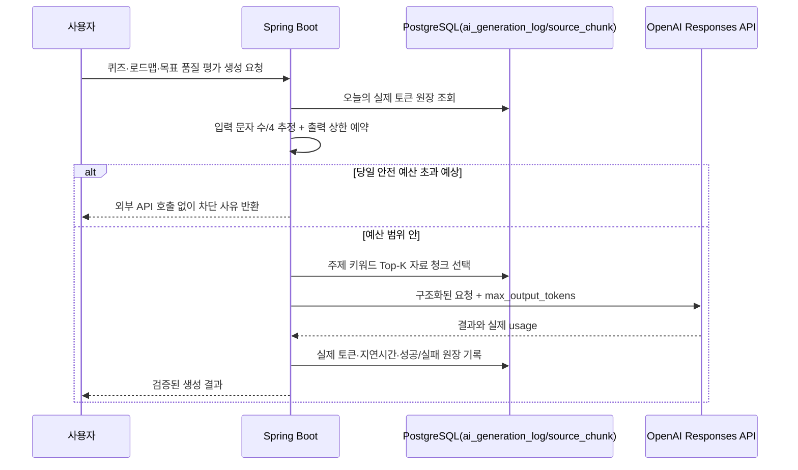

# AI 비용·품질 제어 설계

## 목적

AI 퀴즈와 로드맵은 유용하지만, 입력 자료가 길어지거나 반복 요청이 쌓이면 비용과 응답 시간이 함께 커질 수 있습니다. Auknowlog는 단순히 모델을 호출하는 대신, **호출 전 예산 검사**, **출력 상한**, **자료 문맥 선택**, **실제 사용 원장**을 서버 정책으로 결합합니다.

이 정책은 OpenAI 계정의 청구 한도를 바꾸는 기능이 아닙니다. 애플리케이션이 예상보다 큰 요청을 외부 API로 보내기 전에 막는 로컬 안전장치입니다.

## 처리 흐름



## 1. 요청 전 일일 토큰 안전 예산

`AiUsagePolicyService`는 `ai_generation_log`에서 오늘 자정 이후 기록된 실제 `total_tokens`를 합산합니다. 새 요청은 다음 보수적 계산을 통과해야 합니다.

```text
오늘 실제 사용 토큰 + ceil(요청 문자 수 / 4) + max_output_tokens <= 일일 안전 예산
```

- 기본 예산은 하루 `50,000` 토큰입니다.
- 기본 출력 상한은 퀴즈 `2,400`, 로드맵 `6,000`, 목표 품질 평가 `3,000` 토큰입니다.
- 예산을 넘길 것으로 예상되면 OpenAI API를 호출하지 않고 HTTP 400으로 이유를 반환합니다.
- 실제 사용량은 응답의 `usage.total_tokens`로 사후 기록합니다. 입력 언어·토크나이저에 따라 문자 수/4는 정확한 청구값이 아니라 차단을 위한 보수적 추정치입니다.

설정은 `backend/src/main/resources/application.properties`에서 환경별로 조정할 수 있습니다.

```properties
auknowlog.ai-policy.enforce-daily-token-budget=true
auknowlog.ai-policy.daily-token-budget=50000
auknowlog.ai-policy.quiz.max-output-tokens=2400
auknowlog.ai-policy.roadmap.max-output-tokens=6000
auknowlog.ai-policy.quality.max-output-tokens=3000
```

개발 중 정책을 끄려면 `enforce-daily-token-budget=false`로 설정할 수 있습니다. 단, 이 경우에도 모델 제공자의 사용량·과금·rate limit은 별도로 적용됩니다.

## 2. 출력 토큰 상한

퀴즈, AI 로드맵, 목표 품질 평가는 모두 Responses API 요청에 `max_output_tokens`를 명시합니다. 모델이 필요 이상으로 긴 응답을 만들 수 있는 범위를 제한하고, JSON Structured Outputs와 함께 서버 응답 계약을 안정화합니다.

출력 상한은 생성 결과가 항상 그만큼 비용을 쓴다는 뜻이 아닙니다. 실제 비용 판단은 응답의 `usage` 원장을 기준으로 하며, 상한은 요청 전 안전 예산에 예약하는 최대치입니다.

## 3. 자료 문맥 Top-K 선택

자료 기반 요청은 저장된 모든 `source_chunk`를 보내지 않습니다. 요청 주제에서 영문·한글 키워드를 분리하고, 각 청크에 포함된 서로 다른 키워드 수로 점수를 매겨 상위 청크를 고릅니다. 선택 뒤에는 원래 문서 순서로 다시 정렬합니다.

| 사용처 | 최대 청크 | 최대 문자 수 |
| --- | ---: | ---: |
| 퀴즈 생성 | 4 | 4,800자 |
| AI 로드맵 생성 | 8 | 9,600자 |

이 선택은 DB에 이미 저장된 텍스트만 사용하므로 임베딩 API 호출과 추가 비용이 없습니다. 키워드가 없는 일반 주제는 앞쪽 청크부터 제한 범위 안에서 선택됩니다. 의미적으로 먼 표현까지 찾는 벡터 검색보다 단순하므로, 향후 자료 규모가 커지면 검색 품질 평가를 근거로 pgvector 기반 자료 검색을 별도 검토합니다.

## 4. 운영 화면의 근거

대시보드 AI 운영 영역은 다음 값을 함께 보여줍니다.

- 최근 14일 호출·성공률·토큰·평균/P95 지연시간과 모델별 사용량
- 오늘 실제 토큰 / 당일 안전 예산
- 오늘 남은 안전 예산과 사용률

금액은 모델 단가·환율·할인 정책 변화로 오해를 만들 수 있어 화면에서 추정하지 않습니다. OpenAI 사용량·청구 내역은 OpenAI Platform에서 확인하고, 이 서비스는 요청 단위의 실제 토큰·지연시간과 자체 차단 정책을 보여주는 역할을 맡습니다.

## 검증

- `AiUsagePolicyServiceTest`: 누적 사용량과 예상 요청이 예산을 넘으면 외부 호출 전에 차단되는지, 남은 예산 집계가 맞는지 검증
- `SourceServiceContextSelectionTest`: 주제 관련 청크를 우선 선택하는지 검증
- OpenAI 서비스 모킹 테스트: 세 종류의 요청에 출력 토큰 상한이 포함되고 정책 서비스가 호출되는지 검증
- 이 테스트는 실제 OpenAI API를 호출하지 않아 토큰 비용이 발생하지 않습니다.

## 한계와 다음 단계

현재는 단일 사용자 로컬 프로젝트이므로 예산도 서버 전체 기준입니다. 인증·사용자 소유권을 도입할 때는 사용자별 일일 예산, 요청 횟수 제한, 운영자 알림을 분리해야 합니다. 또한 이 정책은 OpenAI의 결제 상한을 대체하지 않으므로 Platform의 프로젝트 예산·알림도 별도로 설정하는 것이 안전합니다.
