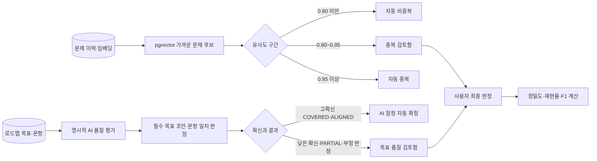

# AI 품질 평가와 Human-in-the-loop

## 목적

AI가 만든 문제를 단순히 저장하는 데서 끝내지 않고, 다음 두 품질 질문을 재현 가능한 데이터로 남긴다.

1. pgvector 중복 임계값이 실제 문제 쌍에서 얼마나 정확한가?
2. 로드맵의 필수 목표가 빠지지 않았고, 문항이 배정 목표를 실제로 묻고 있는가?

AI의 자기평가만으로 품질을 확정하지 않는다. 자동화할 수 있는 후보 수집·초안 판정·집계는 서버가 처리하고, 불확실하거나 부정적인 판정만 사용자 검토함으로 보낸다. 사람 판정이 없는 수치는 **AI 잠정 지표**, 사람 판정이 있는 표본만 사용한 수치는 **사람 검증 지표**로 구분한다.

## 전체 흐름

## 중복 임계값 평가

`중복 후보 수집`은 OpenAI API를 호출하지 않는다. `question_embedding`에 이미 저장된 `vector(512)`를 이용해 각 문제에서 가까운 최대 5개 이웃을 찾고, 한 실행에서 최대 500쌍만 저장한다.

| 유사도 | 초기 시스템 판정 | 이유 |
| --- | --- | --- |
| 0.80 미만 | `DISTINCT` | 초기 기준에서 비교적 명확한 비중복 구간 |
| 0.80 이상 0.95 미만 | `REVIEW_REQUIRED` | 운영 임계값 후보가 달라질 수 있는 애매한 구간 |
| 0.95 이상 | `DUPLICATE` | 표현만 다른 동일 문제일 가능성이 높은 구간 |

위 값은 정답이 아니라 골든 데이터셋을 모으기 위한 초기 정책이다. 사용자는 애매한 문제 쌍만 다음 중 하나로 판정한다.

- `DUPLICATE`: 학습 관점에서 같은 문제
- `RELATED`: 비슷하지만 확인하는 지식이나 판단은 다름
- `DISTINCT`: 다른 문제
- `SKIPPED`: 평가 표본에서 제외

`DUPLICATE`만 양성으로, `RELATED`와 `DISTINCT`는 음성으로 계산한다. `SKIPPED`와 미검토 데이터는 정밀도·재현율에서 제외한다. 서버는 0.75부터 0.95까지 0.01 간격으로 TP·FP·FN·TN, 정밀도, 재현율과 F1을 다시 계산한다. 최소 30개의 사람 표본이 있고 정밀도 90% 이상인 후보 중 재현율과 F1이 높은 값을 추천하지만, 운영 임계값을 자동 변경하지 않는다.

## 분리된 중복 평가 기준 데이터셋

일반 학습 이력은 자연스럽지만 같은 문제인 양성 표본이 부족하거나 주제별로 치우칠 수 있다. 따라서 `backend-korean-v1` 기준 데이터셋은 학습 이력에 문제를 넣지 않고 14개 백엔드 주제의 42쌍을 별도 저장한다.

| 참조 라벨 | 수 | 의도 |
| --- | ---: | --- |
| `DUPLICATE` | 14 | 학습 목표와 정답이 같고 표현만 달라야 함 |
| `RELATED` | 14 | 같은 주제지만 확인하는 판단·세부 개념이 달라야 함 |
| `DISTINCT` | 14 | 다른 학습 목표여야 함 |

`기준 표본 만들기`은 라벨과 문장만 저장하므로 API 비용이 없다. 이후 `실제 유사도 계산`은 사용자 확인을 받고 각 문장을 OpenAI Embeddings API로 512차원 벡터로 변환한다. 저장된 두 벡터의 코사인 유사도를 참조 라벨과 비교해 0.75~0.95 임계값별 성능을 화면에 표시한다. 동일 문장은 한 번만 임베딩해 재사용한다.

이 데이터는 사람이 작성한 초기 참조 기준선이지, 실제 서비스 문제의 최종 품질 증거는 아니다. 포트폴리오에는 데이터셋 구성·라벨 분포·임베딩 모델을 함께 밝히고, 실제 학습 문제에서 얻은 사람 검증 표본과 분리해서 제시한다.

## 목표 누락과 문항 일치 평가

로드맵 전체를 한 번에 보내지 않고 사용자가 선택한 소주제 한 개만 평가한다. 한 요청에는 해당 단계의 목표와 최근 문항 최대 30개만 포함한다.

AI는 두 결과를 구조화 출력으로 반환한다.

- `OBJECTIVE_COVERAGE`: 주제에서 반드시 다뤄야 할 독립 기준 목표를 만들고 기존 목표의 `COVERED`, `PARTIAL`, `MISSING` 여부를 판정
- `QUESTION_ALIGNMENT`: 각 문항이 연결된 목표를 실제로 평가하는지 `ALIGNED`, `PARTIAL`, `MISALIGNED`로 판정

확신도 0.85 이상인 `COVERED`와 `ALIGNED`만 잠정 자동 확정한다. 다음 항목은 사용자 검토함으로 보낸다.

- 확신도 0.85 미만
- `PARTIAL`
- 필수 목표 `MISSING`
- 문항 `MISALIGNED`

부정적인 결과를 확신도가 높다는 이유만으로 운영 사실로 확정하지 않는 이유는, 잘못된 누락 판정이 로드맵과 문제 생성을 불필요하게 늘릴 수 있기 때문이다.

## 저장 데이터와 재현성

Flyway V14~V15가 다음 테이블을 만든다.

| 테이블 | 역할 |
| --- | --- |
| `quality_evaluation_run` | 평가 유형, 대상, 모델, 프롬프트 버전, 토큰과 실행 결과 |
| `duplicate_question_pair` | 문제 쌍과 사람의 최종 판정 |
| `duplicate_evaluation_result` | 실행 시점의 코사인 유사도와 시스템 판정 |
| `objective_evaluation_case` | 기준 목표·문항 일치 AI 판정, 확신도, 근거와 사람 판정 |
| `duplicate_evaluation_dataset` | 버전·상태·임베딩 모델·총 토큰을 가진 분리 기준 데이터셋 |
| `duplicate_evaluation_dataset_sample` | 참조 라벨 문제 쌍, 두 512차원 벡터, 실제 유사도와 선택적 사용자 재검토 결과 |

문제 쌍과 평가 실행을 분리했기 때문에 같은 골든 라벨을 새 임베딩 모델이나 새 임계값에도 다시 사용할 수 있다. 목표 품질 결과에는 모델과 `objective-quality-v1` 프롬프트 버전을 남겨 모델·프롬프트 변경 전후를 구분한다.

## API와 비용 경계

| API | AI 호출 | 역할 |
| --- | --- | --- |
| `POST /api/quality-evaluations/duplicate-runs` | 없음 | 저장된 벡터에서 평가 후보 수집 |
| `POST /api/quality-evaluations/datasets/standard` | 없음 | 학습 이력과 분리된 42쌍 기준 데이터셋 저장 |
| `POST /api/quality-evaluations/datasets/{id}/embeddings` | 있음 | 확인된 기준 데이터셋의 실제 벡터·유사도 계산 |
| `POST /api/quality-evaluations/objective-runs` | 있음 | 선택한 학습 단위의 목표·문항 품질 평가 |
| `GET /api/quality-evaluations/summary` | 없음 | 정밀도·재현율·누락률·일치도·실행 이력 조회 |
| `GET /api/quality-evaluations/reviews` | 없음 | 사람 검토가 필요한 항목 조회 |
| `PUT .../review` | 없음 | 사람의 최종 판정 저장 |

프론트엔드는 AI 목표 평가 버튼을 누를 때 실제 토큰 사용 경고와 확인창을 표시한다. 테스트는 MockRestServiceServer로 Responses API를 대체하며 라이브 OpenAI 호출을 하지 않는다. AI 평가 요청도 `ai_generation_log`, Micrometer와 Prometheus의 `operation=quality`로 기록한다.

## 해석할 때의 제한

- AI 잠정 누락률과 일치도는 품질의 최종 증거가 아니다.
- 사람 검증 지표도 표본 수와 주제 구성이 함께 제시되어야 한다.
- 기준 데이터셋의 참조 라벨은 설계된 초기 기준선이므로, 실제 서비스 이력의 사람 검증 표본과 같은 수치로 합산하지 않는다.
- 문제 쌍이 특정 주제에 치우치면 전체 기술 문제의 임계값을 대표할 수 없다.
- 현재 추천 임계값은 승인 전까지 기존 문제 생성 정책을 변경하지 않는다.
- 한 명의 판정만 사용하므로 다중 평가자 일치도는 아직 측정하지 않는다.

## 검증

- 서비스 단위 테스트: 애매한 유사도 구간만 검토 대상으로 분류하고 사람 라벨만 정밀도·재현율에 사용하는지 확인
- OpenAI 계약 테스트: 구조화 출력 스키마, 모든 문항의 정확히 한 번 판정, 토큰 원장과 부정 판정 검토 전환 확인
- Testcontainers: 실제 PostgreSQL 16 + pgvector에서 V14~V15 테이블, 벡터 후보 쿼리, 분리 데이터셋 벡터 저장, 평가 실행·사람 라벨 저장 확인
- 프론트엔드: 프로덕션 빌드로 품질 평가 화면 번들 생성 확인
