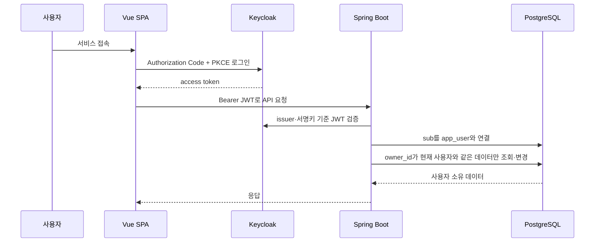

# Keycloak 인증과 사용자별 학습 데이터 분리

## 도입 목적

Auknowlog의 학습 기록·로드맵·자료·복습 일정은 사용자마다 달라야 합니다. 브라우저가 임의의 사용자 식별자를 보내게 하면 다른 사람의 ID를 대입해 데이터를 읽을 수 있으므로, 서버가 검증한 JWT의 `sub`를 유일한 신뢰 근거로 사용합니다. Keycloak은 로그인·토큰 발급·역할 관리를 담당하고 Spring Security는 API마다 토큰과 권한을 검증합니다.



## 권한과 데이터 경계

| 구분 | 정책 |
| --- | --- |
| `USER` | 자신의 학습 자료, 로드맵, 퀴즈, 풀이 기록, 복습 일정과 데일리 진행 상태 사용 |
| `ADMIN` | 개인 학습·품질 평가·전체 사용자 학습/AI 조회·사용자별 AI 한도 변경·감사/발송 이력 조회 |
| 데일리 기사·보충 해설 | 기사당 AI 생성을 반복하지 않도록 공용 콘텐츠로 저장 |
| 데일리 퀴즈·풀이·완료 상태 | `learning_quiz.owner_id`와 `daily_learning_progress.owner_id`로 사용자별 분리 |

주요 소유권 루트는 `source_document`, `learning_roadmap`, `learning_quiz`입니다. 풀이·복습은 퀴즈 관계를 따라 소유자를 확인합니다. 다른 사용자의 ID를 요청해도 소유자 조건에 맞지 않으면 존재하지 않는 데이터처럼 처리해 식별자 존재 여부도 노출하지 않습니다. 자료의 SHA-256 중복 제약도 `(owner_id, content_hash)` 단위라 다른 사용자의 자료 ID를 재사용하지 않습니다.

기존 단일 사용자 데이터는 V20에서 `local-dev-user` / `eunjuny`에 귀속됩니다. Keycloak에 같은 username의 사용자가 처음 로그인하면 애플리케이션이 검증된 `sub`로 연결을 갱신해 기존 학습 데이터를 이어받습니다. 이미 다른 실제 `sub`에 연결된 username은 자동 병합하지 않습니다.

## 로컬 실행 모드

기본 모드는 이전과 같은 로컬 단일 사용자 모드입니다. `/api/admin/**`은 차단하고 나머지 기존 요청은 허용하며 서비스 조회는 로컬 사용자의 `owner_id`를 적용합니다. 전체 관리자 기능은 Keycloak 인증을 켜야 사용할 수 있습니다.

Keycloak 검증 모드는 다음 순서로 켭니다. 관리자 계정 값은 셸 환경이나 Git에서 제외한 로컬 `.env`에만 두고 문서·명령 이력·커밋에 넣지 않습니다.

```bash
# KEYCLOAK_ADMIN_USERNAME, KEYCLOAK_ADMIN_PASSWORD를 로컬 환경에 먼저 설정
docker compose -f docker-compose.yml -f docker-compose.auth.yml up -d postgres keycloak

# Keycloak Admin Console에서 realm=auknowlog 사용자를 만들고 USER 또는 ADMIN realm role 부여
cd backend
SPRING_PROFILES_ACTIVE=keycloak ./gradlew bootRun

cd ../frontend
cp .env.example .env.local
# .env.local의 VITE_AUTH_ENABLED=true로 변경
npm run dev
```

Keycloak realm import에는 `auknowlog-web` public client, Authorization Code, PKCE S256, 로컬 redirect URI와 `USER`·`ADMIN` realm role만 포함합니다. 실제 사용자와 비밀번호는 저장소에 넣지 않습니다.

## 보안 선택과 제약

- SPA에는 client secret을 저장할 수 없으므로 public client + PKCE를 사용합니다.
- API는 세션 쿠키가 아니라 매 요청의 Bearer JWT를 검증하며 CSRF는 비활성화합니다.
- JWT의 `realm_access.roles` 중 `USER`, `ADMIN`만 Spring 권한으로 변환합니다.
- `/actuator/health`, Prometheus scrape, OpenAPI 문서는 인증 예외이고 품질 평가·전체 관리자 API는 `ADMIN` 전용입니다. Actuator는 로컬 운영 포트이며 외부 공개 시 별도 접근 통제가 필요합니다.
- 원격 접속 메일 API는 기존처럼 루프백 전용 검증을 유지하므로 Bearer 토큰 예외입니다.
- Quick Tunnel은 호스트가 매번 바뀌므로 현재 Keycloak client의 로컬 redirect URI와 호환되지 않습니다. 임시 터널은 기본 로컬 모드의 앞단 세션 프록시를 사용하고, OIDC를 외부에 적용할 때는 고정 도메인과 정확한 redirect URI를 등록해야 합니다.
- 현재는 한 조직/realm 안의 사용자 분리입니다. 관리자 API 감사는 구현했으며 고객사별 조직 격리는 `tenant_id`, 조직 관리자, 감사 보존·변조 방지 정책을 별도로 확장해야 합니다.

## 검증

V22는 관리자 접근 감사·공용/사용자 AI 예약·개인 이메일 인증과 학습 알림을 추가합니다. 개인 설정·이력·재시도는 현재 사용자 기준이며 ADMIN도 타인 학습 기록을 변경하지 않습니다. 정책 상세는 [사용자 운영](ACCOUNT_OPERATIONS.md)을 참고합니다. 실제 DB 경쟁 조건과 모의 SMTP 재시도, OIDC 메뉴/API/감사를 검증하며 실제 AI·메일은 호출하지 않습니다.

샘플 준비 명령은 `app-admin`에 USER+ADMIN 역할도 부여합니다. 앱 비밀번호는 `.runtime/osc-sample-accounts.json`의 `applicationAdmin`에 있습니다. master realm `administrator`와 다른 계정입니다. 전체 조회는 관리자 전용 경계로 분리하며 일반 API 소유권 검증은 관리자에게도 유지됩니다. V21은 AI 원장 사용자 귀속을 추가하고 기존·자동 생성 로그는 미귀속으로 남깁니다. 범위·제약은 [전체 관리자 모니터링](OSC_ADDITIONAL_IMPLEMENTATION.md#전체-관리자-모니터링)을 참고합니다.

지원 관련 작업의 지속 기록과 사용자별 샘플은 [osc 추가 구현](OSC_ADDITIONAL_IMPLEMENTATION.md)에 정리합니다. `node scripts/setup-osc-sample-accounts.mjs`는 로컬 Keycloak을 실행하고 test1·test2에 USER 역할을 부여한 뒤 분리된 샘플 학습 데이터를 등록합니다. 랜덤 비밀번호는 Git 제외 경로 `.runtime/osc-sample-accounts.json`에 권한 600으로 저장하며 출력하지 않습니다. 기존 샘플 계정의 비밀번호는 재실행 시 재설정하지 않습니다.

- Spring Security MVC 테스트: 미인증 `401`, USER의 관리자 API `403`, ADMIN의 품질 API `200`
- 서비스·저장 테스트: 소유자 ID가 포함된 repository 계약, 기존 학습 흐름 회귀
- Testcontainers PostgreSQL: Flyway V1~V21, `app_user`, 세 소유권 FK, 사용자별 데일리 진행과 복합 자료 해시 인덱스·AI 원장 owner 추가 마이그레이션
- Vue: Keycloak 초기화 뒤 Axios Bearer 토큰 주입, ADMIN만 품질 메뉴 노출, 생산 빌드

이 검증은 OpenAI API를 호출하지 않습니다.
