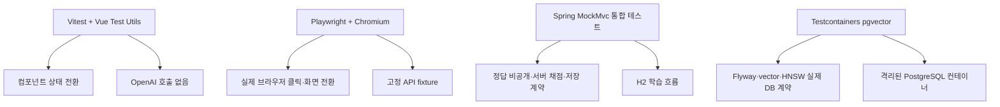

# 프론트엔드 브라우저 검증과 CI

## 목적

백엔드의 MockMvc·Testcontainers 검증만으로는 사용자가 실제 브라우저에서 보는 버튼 상태, 화면 전환, 모바일 레이아웃이 깨지지 않았는지 확인할 수 없습니다. 이 프로젝트는 비용이 드는 OpenAI 호출을 CI에 넣지 않고도 핵심 학습 흐름을 반복 검증하기 위해 Vue 단위 테스트와 Playwright 브라우저 테스트를 분리합니다.

## 검증 계층



Playwright는 Vite 개발 서버를 실제로 실행하고 Chromium으로 화면을 조작합니다. 다만 응답은 고정 fixture로 가로채므로 개인 학습 이력·로컬 PostgreSQL·OpenAI API 키에 접근하지 않습니다. 정답 비공개, 서버 채점, 풀이 저장과 복습 예약의 실제 서버 계약은 기존 `LearningWorkflowIntegrationTest`가 분리해 검증합니다. 두 종류의 테스트를 함께 실행해 브라우저 UI와 서버 신뢰 경계를 혼동하지 않습니다.

## 현재 시나리오

| 구분 | 검증 내용 | 비용·외부 의존성 |
| --- | --- | --- |
| Vue 단위 테스트 | 생성 응답에는 정답이 없고, 모든 보기를 고르기 전 제출 버튼이 비활성인 상태, 제출 뒤 채점·자동 저장 결과 표시 | 없음 |
| Playwright 퀴즈 흐름 | 데모 생성 → 보기 선택 → 제출 → 보기별 해설과 자동 저장 결과 | 고정 fixture, OpenAI 호출 없음 |
| Playwright 데일리 학습 | 기사 해설 표시 → 복습 퀴즈 → 제출 → 완료 상태와 대시보드 전환 | 고정 fixture, RSS·OpenAI 호출 없음 |
| Playwright 모바일 | 360px 뷰포트에서 메뉴 이동과 퀴즈 화면의 가로 넘침 없음 | 고정 fixture |
| Spring 통합 테스트 | 생성 응답의 `correctAnswer`·`explanation` 부재, 서버 채점·풀이 저장·복습 예약 | H2, OpenAI 호출 없음 |
| Testcontainers | pgvector DB에서 Flyway·`vector(512)`·HNSW·코사인 검색 | Docker 이미지, OpenAI 호출 없음 |

## 실행 방법

```bash
cd frontend
npm ci
npm run test
npm run build
npx playwright install chromium
npm run test:e2e
```

로컬 브라우저 설치 파일은 Playwright 캐시에만 저장하며 저장소에 포함하지 않습니다. 실패하면 `test-results/`와 `playwright-report/`에 trace·스크린샷이 남습니다. 두 경로는 Git에서 제외합니다.

## CI 경계

`.github/workflows/frontend-e2e.yml`은 `frontend/**` 변경 PR·push에서 Node 22를 고정하고 다음을 실행합니다.

1. `npm ci`
2. `npm run test`
3. `npm run build`
4. Chromium 설치
5. `npm run test:e2e`

실패 시에만 Playwright 보고서와 trace·스크린샷을 14일간 artifact로 보관합니다. 백엔드 변경은 기존 `backend-integration.yml`에서 Java 21과 `./gradlew check`로 단위·Testcontainers 통합 테스트를 실행합니다. CI는 OpenAI API 키, Gmail 설정, Quick Tunnel 정보, 개인 데이터베이스를 사용하지 않습니다.

## 한계와 다음 단계

- 현재 Playwright는 브라우저와 고정 API fixture를 연결합니다. 실서버 E2E는 별도의 일회성 테스트 DB와 서버 기동 시간이 필요하므로, 백엔드 계약 테스트와 중복하지 않았습니다.
- fixture는 회귀 검증용이며 실제 모델 품질을 평가하지 않습니다. 모델 품질은 품질 평가 메뉴와 사람 검토 표본으로 별도 판단합니다.
- 다음 확장 때는 로드맵 생성·다음 단계 결정·복습 재풀이를 추가하고, 접근성 검사 도구를 도입할 경우 실패 기준과 예외를 문서화합니다.
