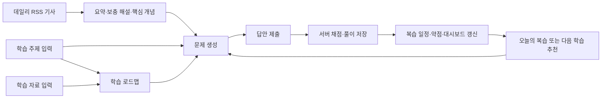
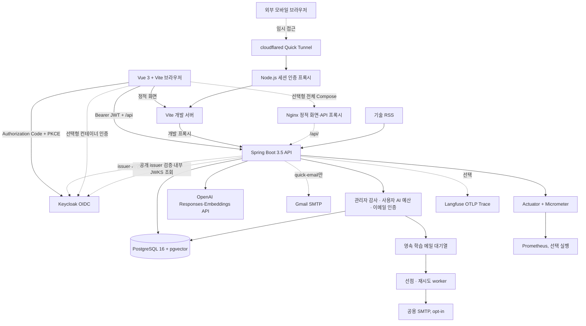
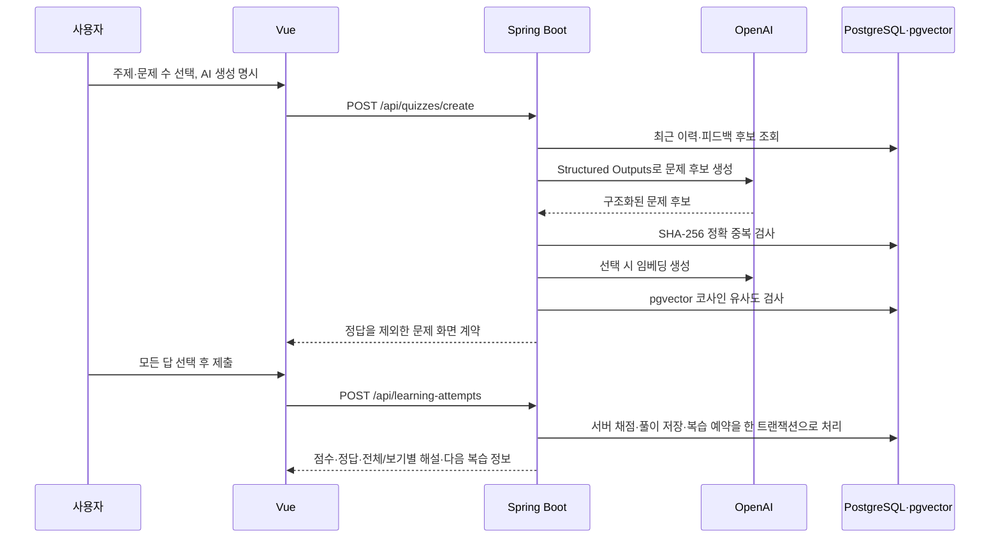
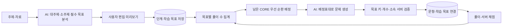

# Auknowlog 통합 설계·운영 가이드

> 이 문서는 Auknowlog를 처음 보는 사람이 **무엇을 해결하는 서비스인지, 각 기능이 왜 필요한지, 어떤 기술로 어떻게 검증했는지**를 한 번에 이해하기 위한 기준 문서다. 세부 구현·보안·실행 절차는 하단의 연결 문서에서 다룬다.

## 1. 서비스 한눈에 보기

Auknowlog는 기술 학습을 위해 주제를 퀴즈로 만들고, 풀이 기록에서 복습·약점·다음 학습 계획까지 연결하는 사용자별 학습 서비스다. 단순 LLM 래퍼가 아니라, AI가 만든 결과를 서버에서 검증하고 영속 데이터·중복 방지·복습 일정·운영 지표와 연결하는 것을 목표로 한다.

### 사용자가 보는 흐름


```mermaid
flowchart LR
    N[데일리 RSS 기사] --> H[요약·보충 해설·핵심 개념]
    H --> B
    A[학습 주제 입력] --> B[문제 생성]
    B --> C[답안 제출]
    C --> D[서버 채점·풀이 저장]
    D --> E[복습 일정·약점·대시보드 갱신]
    E --> F[오늘의 복습 또는 다음 학습 추천]
    F --> B
    A --> G[학습 로드맵]
    S[학습 자료 입력] --> G
    G --> B
```

### 현재 메뉴와 기능

| 메뉴 | 기능 | 필요한 이유 |
| --- | --- | --- |
| 대시보드 | 풀이량·정답률·오늘 복습·약점 추천과 AI 호출·일일 안전 예산 지표를 한 화면에 제공 | 학습 상태와 AI 품질/비용 문제를 분리해 판단한다. |
| 데일리 학습 | 개발 직접 관련 RSS 기사를 우선 선택해 요약·보충 해설·핵심 개념을 읽고 복습·심화 문제를 시작 | 개발 학습을 우선하고 후보가 없을 때만 IT 확장 주제로 내려가며, 기사 소비를 이해·회상·심화 학습으로 연결한다. |
| 문제 생성 | GPT 또는 비용 없는 데모 문제를 생성하고, 로드맵 단계와 연결 | 명시적으로 AI 생성을 선택해야 비용이 발생한다. |
| 오늘의 복습 | 예정된 문제를 다시 풀고 다음 복습일을 계산 | 단발성 퀴즈를 간격 반복 학습으로 확장한다. |
| 학습 로드맵 | 진행 중/완료 탭, 대주제·소주제·필수 학습 목표·선행 관계와 목표별 출제 진행률을 관리 | 학습 순서뿐 아니라 핵심 내용의 누락 여부와 추가 학습·다음 단계 선택을 제어하고, 완료 경로는 목록을 분리해 관리한다. |
| 학습 자료 | TXT·Markdown·PDF·공개 URL·직접 입력을 미리보기 후 저장 | 사용자가 가진 자료를 안전하게 AI 로드맵의 근거로 사용한다. |
| 풀이 기록 | 과거 풀이와 결과를 조회 | 학습 이력의 설명 가능성과 재학습 근거를 남긴다. |
| 품질 평가 | ADMIN이 pgvector 중복 임계값과 필수 목표 누락·문항 일치도를 평가하고 애매한 사례만 검토 | 운영 품질 권한을 일반 학습 사용자와 분리하고, AI 품질 주장을 실제 문제 쌍·사람 라벨·모델/프롬프트 버전으로 재현 가능하게 만든다. |
| 전체 관리자 | ADMIN이 전체/사용자별 풀이·문항 상세·로드맵·복습과 AI 원장·14일 사용량·공유 예산을 읽기 전용 조회 | 일반 사용자 데이터 격리를 유지하면서 전체 학습·AI 운영 현황을 확인한다. |
| 계정·알림 | 개인 AI 사용/예약/한도, 수신 이메일 인증·복습/데일리 opt-in·시간·발송 이력·재시도 | 공용 예산을 사용자별로 보호하고 본인이 인증한 주소로 학습을 안내한다. |

## 2. 전체 구성


```mermaid
flowchart TB
    Browser[Vue 3 + Vite 브라우저] -->|Authorization Code + PKCE| Keycloak[Keycloak OIDC]
    Browser -->|Bearer JWT + /api| Backend[Spring Boot 3.5 API]
    Backend -. issuer·서명·role 검증 .-> Keycloak
    Browser -->|정적 화면| Vite[Vite 개발 서버]
    Vite -->|개발 프록시| Backend
    Browser -. 선택형 전체 Compose .-> Nginx[Nginx 정적 화면·API 프록시]
    Nginx -. /api/ .-> Backend
    Browser -. 선택형 컨테이너 인증 .-> Keycloak
    Backend -. 공개 issuer 검증·내부 JWKS 조회 .-> Keycloak

    Backend --> Postgres[(PostgreSQL 16 + pgvector)]
    Backend --> AccountOps[관리자 감사 · 사용자 AI 예산 · 이메일 인증]
    AccountOps --> Postgres
    AccountOps --> Outbox[영속 학습 메일 대기열]
    Outbox --> MailWorker[선점 · 재시도 worker]
    MailWorker --> LearningSMTP[공용 SMTP, opt-in]
    Backend --> OpenAI[OpenAI Responses·Embeddings API]
    RSS[기술 RSS] --> Backend
    Backend -. quick-email만 .-> Mail[Gmail SMTP]
    Backend --> Metrics[Actuator + Micrometer]
    Metrics --> Prometheus[Prometheus, 선택 실행]
    Backend -. 선택 .-> Langfuse[Langfuse OTLP Trace]

    Mobile[외부 모바일 브라우저] -. 임시 접근 .-> Tunnel[cloudflared Quick Tunnel]
    Tunnel --> AuthProxy[Node.js 세션 인증 프록시]
    AuthProxy --> Vite
```

### 구성 원칙

- 프론트엔드는 표시와 입력을 담당하고, 정답·채점·복습 예약 같은 신뢰 경계는 백엔드에 둔다.
- PostgreSQL을 학습 이력의 단일 원본으로 사용하고, pgvector를 별도 검색 시스템이 아닌 같은 DB 확장으로 사용한다.
- AI는 형식화된 초안을 만들지만, 일일 토큰 예산·출력 상한·자료 문맥 한도·중복·의존 관계·저장은 서버 규칙으로 재검증한다.
- 비용이 드는 외부 호출은 사용자의 명시적 생성 요청에만 수행한다. 단, 사용자가 활성화한 데일리 학습은 오전 스케줄의 기사당 1회 생성만 예외로 하고, 날짜·기사 URL 중복과 일일 안전 예산으로 제한한다.
- 외부 접속은 기본값이 아니며, 필요할 때만 인증 프록시가 있는 임시 터널을 연다.
- 전체 Compose는 기존 호스트 개발 모드와 별개로 Spring Boot·Vue 정적 이미지까지 기동한다. 기본 컨테이너 모드는 단일 사용자·AI/학습 메일 자동 작업 비활성이다. 선택형 인증 오버레이는 Keycloak 공개 issuer와 내부 JWKS를 분리해 로컬 컨테이너 로그인·권한을 검증한다. 공개 HTTPS 운영 배포는 별도 설계 대상이다. [전체 컨테이너 실행](CONTAINER_RUNTIME.md)을 참고한다.
- 인증 프로필에서는 Keycloak의 검증된 `sub`를 `app_user`와 연결하고, 자료·로드맵·퀴즈·풀이·복습을 `owner_id`로 분리한다. 품질 평가는 ADMIN에게만 허용한다.
- 전체 관리자 화면은 `/api/admin/**` 별도 읽기 전용 경계로 교차 사용자 조회를 허용한다. ADMIN도 일반 학습 API에서는 개인 소유권을 적용한다. 서버에서 role을 검증하며 인증 비활성 모드에서는 관리자 API를 차단한다.
- 관리자의 전체 학습 조회는 읽기 전용이고, 사용자별 AI 한도는 전용 정책 API에서 변경한다. 관리자 요청의 호출자·대상·응답 상태를 감사하고 USER의 403 시도도 기록한다. 이메일과 AI 예산·발송 이력은 사용자별 경계로 분리한다.

## 3. 핵심 기능과 동작

### 3.1 문제 생성, 중복 방지, 서버 채점


```mermaid
sequenceDiagram
    participant U as 사용자
    participant F as Vue
    participant B as Spring Boot
    participant AI as OpenAI
    participant DB as PostgreSQL·pgvector

    U->>F: 주제·문제 수 선택, AI 생성 명시
    F->>B: POST /api/quizzes/create
    B->>DB: 최근 이력·피드백 후보 조회
    B->>AI: Structured Outputs로 문제 후보 생성
    AI-->>B: 구조화된 문제 후보
    B->>DB: SHA-256 정확 중복 검사
    B->>AI: 선택 시 임베딩 생성
    B->>DB: pgvector 코사인 유사도 검사
    B-->>F: 정답을 제외한 문제 화면 계약
    U->>F: 모든 답 선택 후 제출
    F->>B: POST /api/learning-attempts
    B->>DB: 서버 채점·풀이 저장·복습 예약을 한 트랜잭션으로 처리
    B-->>F: 점수·정답·전체/보기별 해설·다음 복습 정보
```

정답과 해설은 생성 응답에서 화면으로 보내지지 않는다. 사용자가 답안을 제출하면 서버가 정답과 비교하고, 풀이 기록과 복습 예약을 함께 저장한다. 이 경계가 없으면 브라우저 개발자 도구에서 정답을 확인할 수 있고 정답률·복습 데이터의 신뢰도도 떨어진다. 새 문항은 서버가 정답-보기별 해설 쌍을 보존한 채 문항별 보기 순서를 독립적으로 무작위화하고, 채점·풀이 기록·복습 결과에서 정답뿐 아니라 모든 보기의 이유를 보여준다. 상세 계약은 [퀴즈 정답 분포·보기별 해설 정책](QUIZ_ANSWER_DISTRIBUTION_AND_EXPLANATIONS.md)을 참고한다.

중복 방지는 비용과 품질의 균형을 위해 두 단계다.

1. 정규화한 문제 텍스트의 SHA-256 해시로 같은 문장을 빠르게 차단한다.
2. 임베딩이 켜진 경우 `vector(512)`의 코사인 유사도로 의미가 비슷한 문제를 차단한다. 임베딩 호출이 실패해도 정확 해시 검사는 계속되어 문제 생성 전체가 중단되지 않는다.

사용자가 `TOO_SIMILAR` 피드백을 남긴 문항은 더 낮은 유사도 기준으로 후보를 제외하고 다음 생성 프롬프트의 회피 목록에도 반영한다. 상세 흐름은 [퀴즈 생성·중복 필터링 문서](QUIZ_GENERATION_DUPLICATE_FILTER_FLOW.html)를 참고한다.

### 3.2 복습, 약점 분석, 대시보드

오답은 자동으로 `PENDING` 복습 일정에 들어가고, 정답 문제도 사용자가 원하면 복습 대상으로 추가할 수 있다. 오늘의 복습에서 재풀이하면 서버가 정답 여부에 따라 다음 복습일을 계산하고, 같은 문제의 중복 대기 일정을 막는다.

대시보드는 PostgreSQL의 풀이·복습·AI 생성 원장을 집계한다. 추천은 외부 AI 호출 없이 주제별 정답률, 풀이 수, 마지막 학습일을 규칙으로 계산한다. 따라서 단순한 “AI 추천”이 아니라 설명 가능한 규칙 기반 우선순위다.

### 3.3 문제 품질 피드백

제출 뒤 사용자는 정답 오류, 모호함, 해설 부족, 반복 출제, 난이도 문제를 남길 수 있다. 현재 단일 사용자 모델에서는 문항당 최신 피드백 하나를 갱신해 보관한다. 대시보드에서 유형별 현황을 보고, `TOO_SIMILAR`는 다음 AI 생성의 중복 억제 신호로 사용한다.

### 3.4 계층형 학습 로드맵

로드맵은 대주제와 그 아래 순차 소주제를 가진다. 소주제가 없는 대주제는 단독 학습 단위가 되고, 소주제가 있으면 등록 순서대로 완료되어야 다음 단위가 열린다. 각 실제 학습 단위는 `CORE`·`SUPPORTING` 학습 목표와 목표별 검증 문항 수를 가질 수 있다. 여러 로드맵을 동시에 진행할 수 있고 목표 문항을 모두 풀면 해당 로드맵만 완료 목록으로 이동한다.

관리 화면은 진행 중과 완료 목록을 탭으로 나누어 한 번에 하나의 목록만 보인다. 각 항목은 접힌 요약에서 시작해 필요한 로드맵만 펼치며, 삭제 전에는 “로드맵·단계 정의만 지우고 기존 퀴즈·풀이 기록은 유지한다”는 확인을 표시한다. 삭제는 `learning_quiz`의 로드맵 연결을 `NULL`로 바꾸므로 학습 이력·복습 데이터는 남는다.

필수 목표 문항을 모두 다룬 뒤에는 자동으로 다음 소주제를 열지 않는다. 사용자는 같은 소주제를 추가 학습하거나 `다음 단계로 진행`을 확정한다. 이 확정 전에는 다음 단계가 `LOCKED`이고, 추가 학습은 목표 전체를 다시 순환 배정한다. 목표 충족과 진행 확정은 `learning_roadmap_step.advance_confirmed_at`으로 분리하므로, 진행률 100%가 곧 학습 순서 해제를 뜻하지 않는다. Git 노트는 `로드맵/대주제/소주제.md`로 정리하며 반복 저장은 `-2`, `-3` 순번으로 보존한다. 상세 상태와 Git 저장 구조는 [로드맵 진행·Git 학습 노트](ROADMAP_PROGRESS_AND_GIT_EXPORT.md)를 참고한다.

로드맵을 만드는 방식은 세 가지다.

- 화면에서 직접 대주제·소주제·문제 수·선행 관계를 작성
- `*.roadmap.json` v1.0/v1.1/v1.2를 검증 후 가져오기
- AI가 만든 **저장되지 않은 미리보기**를 편집하고 최종 확인 후 저장

AI 미리보기는 생성할 때만 OpenAI를 호출한다. AI는 먼저 각 소주제에서 빠뜨리면 안 되는 지식·실무 판단을 학습 목표로 분해하고, 목표마다 1~5개의 검증 문항을 배정한다. 사용자는 대주제·소주제뿐 아니라 학습 목표의 이름·설명·중요도·순서·문제 수도 수정할 수 있고, 최종 저장은 다시 모델을 호출하지 않는다.

로드맵 학습을 시작하면 서버는 풀이 이력에서 목표별로 이미 다룬 수를 계산한다. 남은 `CORE` 목표를 우선하면서 목표 사이를 순환해 이번 요청의 배정표를 만들고, 모델에 각 목표 키와 정확한 문제 수를 전달한다. 모델 응답의 `objectiveKey`별 개수와 단계 소속을 서버가 재검증한 뒤 `learning_question.learning_objective_id`로 저장한다. 답안 제출 후 목표별 출제 수·정답 수가 갱신되므로 다음 요청은 아직 덜 다룬 목표만 생성한다. 자료 기반 로드맵은 연결된 `source_document_id`를 퀴즈 생성에도 자동 사용한다.


```mermaid
flowchart LR
    T[주제·자료] --> R[AI: 대주제·소주제·필수 목표 분석]
    R --> P[사용자 편집 미리보기]
    P --> S[(단계·학습 목표 저장)]
    S --> C[목표별 풀이 수 집계]
    C --> A[남은 CORE 우선 순환 배정]
    A --> Q[AI: 배정표대로 문제 생성]
    Q --> V[목표 키·개수·소속 서버 검증]
    V --> L[(문항-학습 목표 연결)]
    L --> E[풀이·서버 채점]
    E --> C
```

서버는 최대 대주제 10개, 대주제별 소주제 10개, 학습 단위별 누적 문제 30개, 단위별 목표 10개와 목표별 문제 5개를 절대 안전선으로 검증한다. 한 번의 퀴즈는 최대 20문제로 유지하므로 30문제 단위는 여러 세션으로 나뉜다. 기존 v1.0/v1.1처럼 학습 목표가 없는 로드맵은 기존 주제 기반 생성으로 계속 동작한다. 상세 계약과 예시는 [로드맵 JSON 형식](ROADMAP_JSON_FORMAT.md)을 참고한다.

### 3.5 학습 자료 수집과 안전 경계

자료는 곧바로 저장하지 않는다. 파일·URL·텍스트를 먼저 추출해 사용자에게 미리보기로 보여주고, 사용자가 확인한 본문만 저장한다. URL 수집에는 사설망·루프백·예약 IP, 사용자 정보, 비표준 포트 차단과 리다이렉트 재검증을 적용해 SSRF 위험을 줄인다. 파일 유형은 Apache Tika로 확인하고, HTML은 jsoup으로 실행 요소·탐색 영역을 제거한다.

저장한 본문은 SHA-256으로 중복을 막고 `source_chunk`로 나눠 보관한다. AI 요청 시에는 앞부분을 고정 전달하지 않고, 요청 주제의 한글·영문 키워드가 많이 겹치는 Top-K 청크만 문자 예산 안에서 보낸다. 이 선택은 저장된 텍스트만 사용하므로 임베딩 API 추가 호출이 없으며, 외부 문서의 지시문은 실행하지 않는 데이터로 취급한다. 상세 제한과 위협 모델은 [학습 자료 수집 보안 설계](SOURCE_INGESTION_SECURITY.md), 비용·품질 정책은 [AI 비용·품질 제어 설계](AI_COST_AND_QUALITY_CONTROL.md)를 참고한다.

### 3.6 외부 접속

기본값은 로컬 접속이다. 필요할 때만 `cloudflared`가 임시 HTTPS URL을 만들고, Node.js 프록시가 로그인 폼·세션 쿠키·실패 횟수 제한을 처리한 뒤 Vite에 전달한다. 터널은 기본 8시간 뒤 종료되고, 공개 URL과 임시 인증정보는 종료 시 삭제한다. 이는 개발·개인 확인용이며 정식 배포 대체가 아니다.

`quick-email`은 새 터널의 미인증 `302`·인증 성공 `200`을 확인한 다음에만 Spring Mail과 Gmail SMTP STARTTLS(587)로 URL·임시 사용자명·비밀번호·만료 시각을 **고정된 본인 수신 주소**에 한 번 보낸다. 백엔드는 `127.0.0.1`에서만 열고 Vite 프록시도 이 메일 API를 제외해, 외부 브라우저가 임의 발송을 시도할 수 없게 했다. 메일 자격 증명과 수신 주소는 Git에서 제외된 로컬 설정에만 존재하며 API 응답·로그에 넣지 않는다. 평문 메일은 개인 임시 접속에만 허용하므로 정식 서비스에서는 계정 인증·일회성 링크로 바꿔야 한다.

Codex 로컬 자동화는 매일 오전 8시(Asia/Seoul)에 서비스 상태를 복구하고 기존 터널을 폐기한 뒤 새 `quick-email`을 실행한다. 성공한 터널은 최대 8시간 유지하고 실패 시 새 터널을 정리한다. 로컬 예약이므로 맥·Codex 호스트·네트워크·Docker가 실행 가능해야 하며, 퀴즈·임베딩 API는 호출하지 않는다. 상세 조건은 [외부 접속 운영 가이드](REMOTE_ACCESS.md)를 참고한다.

데일리 학습은 `daily_learning`에 날짜별 기사·선택 등급·요약·보충 해설·핵심 개념·복습 주제·동적 문항 수·완료 상태를 저장한다. 매일 오전 7:30(Asia/Seoul) 스케줄러가 RSS 후보의 제목·설명·카테고리를 점수화해 `DEVELOPER_CORE`(개발 직접 관련) → `DEVELOPER_ADJACENT`(개발 인접) → `IT_EXPANSION` 순으로 기사 하나를 고른다. 이 선택 단계에는 OpenAI를 호출하지 않는다. 이어 기존 URL 수집기의 SSRF 방어·리다이렉트·응답 크기 제한을 거쳐 원문을 `source_document`에 저장한다. 그 후 OpenAI Structured Outputs가 기사 요약, 700~1,400자 수준의 보충 해설, 3~7개 핵심 개념, 2~12개의 복습 문항 수를 결정한다. 같은 날짜 또는 같은 기사 URL이 이미 있으면 기존 결과를 반환해 재시도·스케줄 중복이 추가 비용을 만들지 않는다.

앱 상단 `데일리 학습` 메뉴는 서버의 오늘 상태를 조회한다. 복습 문제는 보충 해설을 포함한 저장 자료를 근거로 기존 퀴즈 생성·정답 비공개·서버 채점·풀이 기록·오답 복습 예약 흐름을 그대로 사용한다. 복습 퀴즈를 제출하면 `COMPLETED`로 전환하고, 다음 접속의 첫 화면은 대시보드가 된다. 심화 주제는 사용자가 입력하며 같은 자료를 근거로 별도 퀴즈를 생성한다. Git 저장 시 `daily-tech/{날짜}-{기사명}/learning.md`에 기사·해설을, `review/`와 `advanced/`에 퀴즈를 나누어 기록한다. 상세 실행·비용·실패 처리 기준은 [데일리 기술 학습 설계](DAILY_TECH_LEARNING.md)를 참고한다.

### 3.7 AI 품질 평가와 사람 검토

중복 임계값 평가는 기존 `question_embedding`에서 가까운 문제 쌍을 pgvector로 찾으므로 OpenAI를 호출하지 않는다. 0.80 미만은 자동 비중복, 0.95 이상은 자동 중복으로 분류하고 그 사이는 사용자 검토함에 넣는다. 정밀도·재현율·F1은 AI 판정이 아니라 사용자가 `DUPLICATE`, `RELATED`, `DISTINCT`로 확정한 표본만 사용한다. 최소 30표본과 정밀도 90% 조건을 충족해야 추천 임계값을 표시하며 운영 설정은 자동으로 바꾸지 않는다.

필수 목표와 문항 일치 평가는 선택한 로드맵 학습 단위 하나를 OpenAI Structured Outputs로 평가한다. 고확신 `COVERED`·`ALIGNED`만 잠정 자동 확정하고, 낮은 확신·부분 일치·목표 누락·문항 불일치는 검토함으로 보낸다. 화면은 AI 잠정 지표와 사람 검증 지표를 나누어 표시하고 평가 실행에는 모델·프롬프트 버전·토큰을 함께 저장한다. 상세 흐름과 해석 한계는 [AI 품질 평가 문서](AI_QUALITY_EVALUATION.md)를 참고한다.

대시보드에는 사람 검증 표본으로 계산한 임계값별 정밀도·재현율·F1 곡선과, AI 잠정·사람 검증을 분리한 목표 누락률·문항 일치도 막대 차트를 함께 표시한다. 차트 조회는 저장된 평가 데이터를 집계할 뿐 AI·임베딩 API를 호출하지 않으며, 표본이 부족할 때는 수치를 꾸며내지 않고 표본 수집 안내를 표시한다.

실제 학습 문제만으로 중복 양성·음성 표본을 균형 있게 모으기 어려워, 학습 이력과 분리된 `backend-korean-v1` 기준 데이터셋을 제공한다. 14개 백엔드 주제에서 같은 문제·관련 문제·다른 문제를 각각 14쌍씩 작성해 총 42쌍의 참조 라벨을 저장한다. 문장 저장은 비용이 없고, 사용자가 확인한 경우에만 두 문장의 512차원 임베딩과 코사인 유사도를 계산한다. 이 결과는 초기 기준선이며, 실제 학습 문제의 사람 검증 표본을 대체하지 않는다.

기준 표본을 사용자가 다시 판정하면 초기 참조 라벨을 덮어쓰지 않고 `reviewer_verdict`로 별도 보관한다. 따라서 데이터셋을 만든 판단과 사용자 독립 판단의 일치 여부를 확인할 수 있으며, 이 보조 검토 기록은 실제 학습 이력의 사람 검증 통계와 섞지 않는다.

## 4. 데이터 모델

| 영역 | 주요 테이블 | 역할 |
| --- | --- | --- |
| 문제 이력·중복 | `question_history`, `question_embedding` | 정확 해시와 pgvector 임베딩으로 기존 문제를 비교 |
| 퀴즈·풀이 | `learning_quiz`, `learning_question`, `learning_attempt`, `learning_attempt_answer` | 생성된 문제, 목표 연결, 서버 채점 결과와 사용자 답안을 저장 |
| 복습 | `review_schedule`, `review_attempt` | 다음 복습일과 재풀이 이력을 관리 |
| AI 운영 | `ai_generation_log` | 모델·성공/실패·토큰·지연시간 원장을 저장 |
| 품질 피드백 | `question_feedback` | 문항별 최신 품질 의견을 보관 |
| 로드맵 | `learning_roadmap`, `learning_roadmap_week`, `learning_roadmap_step`, `learning_roadmap_step_dependency`, `learning_objective` | 계획 원본, 계층형 단계·선행 관계, 진행 확정 시각과 핵심 내용별 목표 문제 수를 관리 |
| 학습 자료 | `source_document`, `source_chunk` | 원문 출처·본문 해시·분할 문맥을 저장 |
| AI 품질 평가 | `quality_evaluation_run`, `duplicate_question_pair`, `duplicate_evaluation_result`, `objective_evaluation_case` | 평가 실행·모델·토큰, 문제 쌍의 시스템/사람 판정과 목표·문항 품질 근거를 저장 |
| 중복 평가 기준 데이터셋 | `duplicate_evaluation_dataset`, `duplicate_evaluation_dataset_sample` | 학습 이력과 분리한 참조 라벨 문제 쌍, 두 벡터·실제 유사도와 임베딩 사용량을 저장 |
| 데일리 학습 | `daily_learning`, `source_document`, `learning_quiz.daily_learning_id` | 날짜별 기사·개발 관련성 선택 등급·AI 해설·핵심 개념과 복습/심화 퀴즈·완료 상태를 연결 |
| 사용자·소유권 | `app_user`, `source_document.owner_id`, `learning_roadmap.owner_id`, `learning_quiz.owner_id`, `daily_learning_progress` | Keycloak `sub` 연결, 사용자별 자료·로드맵·퀴즈·하위 풀이/복습 및 데일리 완료 상태를 격리 |
| AI 사용자 귀속 | `ai_generation_log.owner_id` | 이후 인증 사용자 호출을 귀속하고 기존·백그라운드 호출은 NULL로 유지. 임베딩도 원장에 측정 사용량·지연·실패 기록 |
| 관리자 감사·AI 예산 | `admin_audit_log`, `app_user.ai_daily_*`, `ai_budget_bucket`, `ai_budget_reservation` | 교차 사용자 접근 추적, 사용자/공용 예산의 원자적 예약·정산과 API 시도 제한 |
| 학습 메일 | `user_notification_setting`, `learning_notification_outbox` | 본인 이메일 인증·수신 동의와 영속 발송 대기열·일일 중복 방지·재시도 |

스키마는 Flyway V1~V22로 관리한다. V13은 학습 목표와 문항-목표 연결을, V14는 품질 평가 실행·문제 쌍·목표 검토 데이터를, V15는 분리된 중복 평가 기준 데이터셋을, V16은 로드맵 단계의 목표 충족과 진행 확정 상태를 분리하는 시각을, V17은 보기별 해설을, V18은 날짜별 기사 학습과 데일리 퀴즈 연결을, V19는 데일리 기사 선택 등급을, V20은 Keycloak 사용자와 학습 데이터 소유권·사용자별 데일리 진행을, V21은 AI 원장 사용자 귀속과 조회 인덱스를, V22는 관리자 감사·AI 예산 예약·사용자별 학습 메일을 추가한다. JPA의 자동 DDL 생성을 사용하지 않고 애플리케이션 시작 시 스키마를 검증한다.

## 5. 기술과 OSS 선택 근거

다중 사용자 운영에는 새 Redis/브로커 없이 PostgreSQL 행 잠금·유일 제약·영속 발송 대기열과 기존 Spring Mail을 사용한다. 현재 호출량에서 외부 시스템 수를 늘리지 않고 경쟁 조건·중복·재시도를 실제 DB로 검증할 수 있기 때문이다. [사용자 운영 정책과 검증](ACCOUNT_OPERATIONS.md)에 동작 흐름·제약을 정리한다.

| 구분 | 기술·OSS | 선택 이유 | 사용 위치 |
| --- | --- | --- | --- |
| 언어·서버 | Java 21, Spring Boot 3.5, Virtual Threads | 타입 안정성, 트랜잭션·검증·운영 도구 생태계와 I/O 중심 API 처리에 적합 | API, 도메인 서비스, 외부 HTTP 호출 |
| 프론트엔드 | Vue 3, Vite, Axios | 단일 학습 도구 UI를 빠르게 구성하고 화면 단위를 지연 로딩 | 메뉴별 화면과 API 호출 |
| 인증·권한 | Spring Security, OAuth2 Resource Server, Keycloak | 표준 OIDC 로그인과 JWT 검증을 애플리케이션 비밀번호 저장 없이 적용하고 USER/ADMIN 권한을 분리 | Authorization Code + PKCE, Bearer JWT, 품질 평가 RBAC |
| 프론트 검증 | Vitest, Vue Test Utils, Playwright | 빌드만으로 발견하지 못하는 제출 상태·실제 브라우저 전환·모바일 레이아웃 회귀를 자동 차단 | 컴포넌트·Chromium E2E·GitHub Actions |
| 영속성 | PostgreSQL 16, Spring Data JPA | 관계형 학습 데이터, 제약 조건, 트랜잭션과 분석 집계를 한 DB에서 처리 | 풀이·복습·로드맵·자료·운영 원장 |
| 벡터 검색 | pgvector 0.8 | 별도 검색 클러스터 없이 PostgreSQL 원본 데이터와 벡터를 함께 관리 | 문제 임베딩과 코사인 유사도 검색 |
| 스키마 관리 | Flyway | 환경마다 같은 순서의 DB 변경과 검증 가능한 이력 | V1~V20 마이그레이션 |
| AI 생성·평가 | OpenAI Responses API, Structured Outputs | 퀴즈·로드맵의 JSON 계약을 제한하고, 출력 토큰 상한·서버 사전 예산 검사 아래 품질 평가도 모든 문항 ID·판정·확신도를 구조화해 재검증 | 문제·로드맵 초안, 목표별 문제 생성, 명시적 목표 품질 평가 |
| 임베딩 | OpenAI Embeddings, `text-embedding-3-small`, 512차원 | 의미 유사 문제 후보를 비용 제한 아래 비교 | 선택적 중복 검사 |
| 자료 추출 | Apache Tika, jsoup | 실제 파일 유형 확인·PDF 텍스트 추출·HTML 정제 | 파일/URL 미리보기 |
| 관측 | Spring Actuator, Micrometer, Prometheus | 애플리케이션 지표를 표준 형식으로 노출하고 필요한 경우만 수집 | AI 호출·문제 생성·자료 수집 지표 |
| AI Trace | OpenTelemetry, Langfuse(선택) | 특정 AI 요청의 입력·출력·지연·실패를 추적 | 키를 설정했을 때만 OTLP 전송 |
| 통합 테스트 | Testcontainers | H2가 지원하지 않는 `vector`, HNSW, 코사인 SQL을 실제 PostgreSQL 컨테이너에서 검증 | `integrationTest` |
| 로컬 인프라 | Docker Compose | PostgreSQL·pgvector, 선택적 Prometheus·Keycloak을 반복 가능하게 기동 | 개발·통합 테스트·OIDC 검증 |
| 임시 외부 접속 | cloudflared, Node.js 인증 프록시 | 공유기 설정 없이 임시 HTTPS URL을 만들고 인증을 별도로 강제 | 개인 모바일 확인 |
| 원격 접속 안내 | Spring Mail, Gmail SMTP | 새 임시 URL·자격 증명을 고정 수신자에게 명시적으로 전달 | `quick-email` 로컬 운영 명령 |

기술별 대안·도입 결정은 [기술 의사결정 기록](TECHNOLOGY_DECISIONS.md), 이전 구조와의 비교는 [스택 전환 비교](STACK_TRANSITION.md)를 참고한다.

## 6. API와 실행 경계

| API 영역 | 대표 엔드포인트 | 책임 |
| --- | --- | --- |
| 퀴즈 | `POST /api/quizzes/create`, `POST /api/quizzes/dummy` | AI 또는 데모 문제 생성 |
| 풀이 | `POST /api/learning-attempts` | 서버 채점·풀이 저장·오답 복습 예약 |
| 복습 | `GET /api/reviews`, `POST /api/reviews/{id}/answer` | 오늘의 복습 조회와 재풀이 |
| 로드맵 | `POST /api/learning-roadmaps/ai/previews`, `POST /api/learning-roadmaps/ai/confirm`, `POST /{roadmapId}/steps/{stepId}/advance`, `DELETE /{roadmapId}` | 저장 전 AI 미리보기, 편집 결과 저장, 다음 단계 진행 확정, 로드맵 정의 안전 삭제 |
| 데일리 학습 | `GET /api/daily-learnings/today`, `POST /generate`, `POST /{id}/review-quiz`, `/advanced-quiz` | 개발 직접 관련 우선 RSS 기사 기반 오늘 학습 조회·명시적 재생성·근거 기반 복습/심화 퀴즈 생성 |
| 인증 | `GET /api/auth/me`, `GET /api/auth/mode` | 검증된 JWT 사용자를 로컬 사용자와 연결하고 현재 역할·인증 모드를 제공 |
| 전체 관리자 | `GET /api/admin/summary`, `/users`, `/records/{kind}`, `/attempts/{id}` | ADMIN만 전체 학습/AI 모니터링·사용자 필터·풀이 상세를 조회. 기본 20건, 최대 100건 페이지 경계 |
| 사용자 AI 정책 | `GET /api/account/ai-budget`, `GET /api/admin/ai-budget`, `GET/PUT /api/admin/users/{id}/ai-budget` | 본인 사용·예약 조회와 ADMIN 한도 변경, 실제 호출 전 예산 예약·초과 429 |
| 학습 이메일 | `/api/account/notifications`, `/verification`, `/verify`, `/send-now`, `/history`, `/{id}/retry` | 본인 수신 설정·인증·현재 학습 알림 예약·이력·제한된 재시도 |
| 관리자 운영 이력 | `GET /api/admin/records/audits`, `/records/notifications` | 접근 감사와 사용자별 발송 상태 조회, 이메일·비밀값·메일 본문 제외 |
| 품질 평가 | `/api/quality-evaluations/**` | ADMIN만 중복 임계값·목표 품질 평가와 사람 검토 수행 |
| 자료 | `POST /api/sources/previews/file`, `/url`, `/text`, `POST /api/sources` | 안전한 추출 미리보기와 확인 저장 |
| 피드백 | `PUT /api/question-feedback` | 문항 품질 피드백 갱신 |
| 대시보드 | `GET /api/dashboard` | 학습·운영 지표와 추천, 사람 검증 기반 중복 임계값 곡선 및 목표 품질 비교 차트 집계 |
| 품질 평가 | `POST /api/quality-evaluations/*-runs`, `GET /summary`, `GET /reviews`, `PUT .../review`, `/datasets/*` | 비용 없는 벡터 후보 수집, 분리된 기준 데이터셋 저장·명시적 임베딩, AI 목표 평가, 사람 검토와 검증 지표 집계 |
| 원격 접속 메일 | `POST /api/notifications/remote-access/email` | localhost 운영 스크립트의 검증된 접속 정보만 고정 수신자에게 전송 |
| 운영 | `/actuator/health`, `/actuator/prometheus` | 상태 확인과 Prometheus 수집 |

정확한 요청·응답 DTO는 Swagger UI(`http://localhost:8080/swagger-ui.html`)와 각 Controller를 기준으로 확인한다.

## 7. 실행, 비용, 보안

### 로컬 실행

```bash
docker compose up -d
cd backend && ./gradlew bootRun
cd frontend && npm install && npm run dev
```

- 프론트엔드: `http://localhost:5173`
- 백엔드·Swagger: `http://localhost:8080/swagger-ui.html`
- Prometheus(선택): `docker compose --profile monitoring up -d`, `http://127.0.0.1:9090` (운영 지표 60일 보관, `prometheus_data` named volume 사용)
- Keycloak(선택): 관리자 시크릿을 로컬 환경에 설정한 뒤 `docker compose -f docker-compose.yml -f docker-compose.auth.yml up -d`; 백엔드 `keycloak` 프로필과 프론트 `VITE_AUTH_ENABLED=true`를 함께 사용한다.

### 비용 경계

- 데모 문제, 규칙 기반 추천, DB 조회·채점·복습은 OpenAI 비용이 없다.
- 실제 퀴즈·AI 로드맵 미리보기는 명시적 버튼 클릭에서만 OpenAI를 호출한다.
- 데일리 학습 해설은 매일 오전 7:30 스케줄에서 기사당 한 번 호출하며, 스케줄이 놓친 날의 수동 재시도도 같은 날짜 결과가 있으면 호출하지 않는다. 복습·심화 퀴즈는 사용자가 시작할 때만 별도 호출한다.
- 품질 평가의 중복 후보 수집·검토·지표 계산은 AI 비용이 없다. 목표·문항 평가는 선택한 학습 단위에서 사용자가 확인한 경우에만 OpenAI를 한 번 호출한다.
- 기준 데이터셋은 문제 쌍과 참조 라벨을 먼저 저장하며 이 단계에는 AI 비용이 없다. `실제 유사도 계산`은 화면 확인 후에만 OpenAI Embeddings API를 호출하고, 학습 문제 이력·중복 방지 대상에는 넣지 않는다.
- AI 로드맵 최종 저장은 미리보기 편집 결과를 검증·저장할 뿐 모델을 다시 호출하지 않는다.
- 목표 기반 출제는 별도 AI 호출을 추가하지 않고 기존 퀴즈 생성 프롬프트에 남은 목표 배정표를 포함한다. 자료 기반 로드맵은 근거 청크가 입력 토큰에 포함된다.
- 임베딩은 실제 AI 문제 생성에 연결되며, 장애 시 정확 해시 검사로 폴백한다.
- Prometheus·Testcontainers·Quick Tunnel은 로컬 개발 도구다. 정식 클라우드 배포 비용은 아직 발생시키지 않는다.
- 원격 접속 Gmail SMTP는 기존 `quick-email`에서만 연결한다. 별도 학습 메일은 기본 꺼짐이며 `AUKNOWLOG_LEARNING_MAIL_ENABLED=true`와 사용자 이메일 인증·수신 동의가 있어야 예약 발송한다. 인증 메일은 사용자의 명시적 요청으로만 발송한다. 제공자 발송 한도·정책은 별도 적용된다.

### 시크릿과 보안 경계

- OpenAI·Langfuse·Notion·Git 키와 DB 비밀번호는 Git에 포함되지 않는 `backend/application-api.properties` 또는 환경 변수로만 주입한다.
- 외부 URL과 임시 터널 비밀번호도 `.runtime/`에만 보관하고 Git에 넣지 않는다.
- Gmail 앱 비밀번호와 발신·수신 주소는 로컬 설정 또는 OS 시크릿 저장소에만 두며, API 요청·응답·로그에는 기록하지 않는다.
- API 키는 브라우저로 보내지 않으며, OpenAI 호출은 백엔드만 수행한다.
- Keycloak 프로필에서는 JWT의 issuer·서명과 `USER`·`ADMIN` realm role을 검증하고, 서버가 확인한 `sub`로만 사용자를 식별한다. 브라우저가 owner ID를 선택할 수 없다.
- 자료·로드맵·퀴즈는 `owner_id`로 분리하고 풀이·복습은 퀴즈 소유권을 따라 조회한다. 데일리 기사 본문은 비용 절감을 위해 공용이지만 퀴즈·완료 상태는 사용자별이다.
- 현재 권한 모델은 한 realm 안의 USER/ADMIN이며 관리자 요청 감사는 구현했다. 고객사별 멀티 테넌시는 `tenant_id`, 조직 관리자와 감사 보존·변조 방지 정책을 추가해야 한다. [Keycloak 인증·사용자 데이터 분리](AUTHENTICATION_AND_TENANCY.md), [사용자 운영 정책](ACCOUNT_OPERATIONS.md)을 참고한다.

## 8. 검증 근거

V22 운영 정책은 `AccountOperationsIntegrationTest`에서 실제 PostgreSQL 8개 동시 예산 예약·정산/해제·공용 예산·감사 대상·이메일 인증·알림 중복/사용자 분리/SMTP 재시도를 검증한다. 실제 발송기는 모의 객체로 대체한다. 실제 OIDC 로그인으로 계정·알림 메뉴, 개인 API, 관리자 한도 저장과 감사 200/403 결과도 확인한다. 실행 명령과 검증 한계는 [ACCOUNT_OPERATIONS.md](ACCOUNT_OPERATIONS.md)를 따른다.

2026-09-30 재검증에서 백엔드 `check --rerun-tasks`로 단위·실제 DB 통합 테스트를 모두 새로 실행해 통과했고, Vue 단위 5개·Playwright 3개·프로덕션 빌드도 통과했다. 기존 호스트 인증 모드에서는 `verify-osc-samples.mjs`로 test1/test2 실제 OIDC 로그인·서로의 기록 404·ADMIN 전체 조회·미인증 401을 재확인했다. OpenAI 호출과 학습 메일 발송은 하지 않았다. 분리된 Compose 환경의 이미지·Health·프록시 검증은 [전체 컨테이너 실행](CONTAINER_RUNTIME.md)에 정리한다.

전체 관리자 추가 검증은 [osc 추가 구현](OSC_ADDITIONAL_IMPLEMENTATION.md#전체-관리자-모니터링)에 정리한다. 실제 Keycloak app-admin 로그인, 사용자별 필터·두 샘플 계정 풀이 상세·전체 AI 원장 조회, USER 403·미인증 401·개인 API 타인 기록 404를 검증한다. V21 적용 후 생성 원장의 사용자 귀속과 시스템 미귀속, 임베딩 성공/실패 기록은 비용 없는 모의 호출로 확인한다. 관리자 조회는 AI API를 호출하지 않으며 토큰 집계는 청구 금액이 아니다. 이전 AI 로그는 사용자 추정 없이 미귀속으로 유지한다.

| 계층 | 실행 방법 | 검증하는 것 |
| --- | --- | --- |
| 단위/H2 | `cd backend && ./gradlew test` | DTO·서비스 규칙·서버 채점·복습·자료 보안·목표별 배정, 미인증 401·USER 403·ADMIN 200 권한 계약 |
| 실제 DB 통합 | `cd backend && ./gradlew integrationTest` | Testcontainers PostgreSQL 16 + pgvector, Flyway V1~V20, 사용자·소유권 FK와 복합 자료 해시 인덱스, 학습 목표·품질 평가·데일리 진행/FK, vector(512), HNSW, 차원 불일치 거부 |
| 전체 백엔드 | `cd backend && ./gradlew check` | 단위와 실제 DB 통합 테스트를 함께 실행 |
| 프론트 빌드 | `cd frontend && npm run build` | Vue 생산 번들 생성 가능 여부 |
| 프론트 브라우저 | `cd frontend && npm run test:e2e` | 데모 채점·데일리 복습·모바일 주요 화면 |
| 전체 컨테이너 | `docker compose -f docker-compose.yml -f docker-compose.app.yml up --build -d --wait` 후 `bash scripts/verify-compose-app.sh` | 실제 이미지·PostgreSQL 기동, 백엔드 Health·정적 화면·API 프록시·메일 경계 |
| 인증 컨테이너 | `node scripts/run-compose-auth-smoke.mjs` | 분리된 실제 Keycloak·DB·Nginx·Spring Boot에서 Chromium PKCE 로그인, 사용자 기록 404·USER 403·ADMIN 200·익명 401, 테스트 자원 정리 |
| Prometheus 연결 | `./scripts/verify-prometheus.sh` | 핵심 metric export, 고카디널리티 label 부재, readiness와 실제 scrape target `UP`; OpenAI 호출 없음 |
| 원격 접속 메일 | `./scripts/remote-access.sh quick-email` | 공개 URL 인증 검증 뒤 로컬 SMTP API와 Gmail SMTP의 발송 요청 수락 |
| CI | GitHub Actions `Backend verification`, `Frontend browser verification`, `Container smoke verification` | Java·pgvector 통합, Vue 브라우저 흐름, 기본·인증 전체 이미지 기동과 HTTP/권한 계약을 분리 검증 |

실제 PostgreSQL 검증의 범위와 한계는 [pgvector·Testcontainers 통합 테스트](PGVECTOR_INTEGRATION_TEST.md)에 정리한다.

## 9. 다음 목표

오픈소스컨설팅 지원 관련 인증·사용자 격리 작업은 **“osc 추가 구현”**으로 기록한다. 범위와 후속 과제, `test1`·`test2`의 분리된 샘플 로드맵·풀이·복습, Keycloak master 관리자와 앱 ADMIN의 차이는 [osc 추가 구현 기록](OSC_ADDITIONAL_IMPLEMENTATION.md)을 기준으로 이어간다.

| 항목 | 현재 상태 | 다음 구현 전제 |
| --- | --- | --- |
| 이메일 원격 접속 알림 | 구현·수동 검증·오전 8시 예약 완료 | 수동 `quick-email` 또는 로컬 Codex 자동화에서 Gmail SMTP로 고정 수신자에게 1회 전송 |
| 전체 컨테이너화·프론트 CI·E2E | 로컬 단일 사용자·Keycloak 인증 모드 실제 기동 검증 완료 | 백엔드·프론트 이미지, Compose, 브라우저 테스트와 HTTP/OIDC smoke. 공개 HTTPS·클라우드 운영은 별도 범위 |
| AI 비용·품질 제어 2차 | 구현 완료 | 공용/사용자별 예약·정산·API 시도 제한, 관리자의 한도 변경. 다음은 미정산 사고 처리·청구 대조 |
| 인증·사용자 소유권·관리자 감사 | 구현 완료 | Keycloak·소유권·전체 관리자와 접근 감사. 다음은 고객사 tenant·감사 보존/변조 방지 |
| 사용자별 학습 이메일 | 구현·모의 발송 검증 완료 | 이메일 인증·opt-in·시간·일일 중복 방지·재시도, 기본 꺼짐. 실제 SMTP 활성화는 별도 설정 |
| Grafana·알림 규칙 | 예정 | Prometheus 장기 수집·실제 운영 임계값이 쌓인 뒤 도입 |
| Terraform·클라우드 배포 | 비용 검토 후 예정 | 별도 AWS 계정, 예산 알림, `plan` 검증과 삭제 절차 |

### 이메일 원격 접속 알림 운영 방식

개인용 저용량 기준으로 Gmail SMTP와 Spring Mail을 사용한다. `quick-email`은 URL과 임시 인증 정보를 보낼 때만 SMTP 연결을 만들며, 사용자가 직접 실행하지 않는 한 메일을 보내지 않는다.

| 필요 정보 | 예시·선택 기준 | 저장 위치 |
| --- | --- | --- |
| 발신 주소 | Gmail SMTP 로그인 계정 | 로컬 환경 설정 |
| 수신 주소 | 고정된 본인 수신용 이메일 1개 | 로컬 환경 설정 |
| SMTP 인증 | Gmail 2단계 인증 후 생성한 16자리 앱 비밀번호 | `application-api.properties` 또는 OS 시크릿 저장소, Git 금지 |
| 발송 시점 | `quick-email` 명시 실행 또는 매일 오전 8시 자동화 후, 터널 인증 검증 성공 시 | 운영 스크립트·Codex 자동화 |
| 터널 정책 | 새 터널, 기본 8시간 최대 유지, 매번 새 임시 비밀번호 | 운영 스크립트 |
| 메일 내용 | URL·사용자명·임시 비밀번호·만료 시각 | 서버 템플릿 |
| 실패 정책 | SMTP 수락 실패 시 시작한 터널 종료, 자동 재시도 없음 | 운영 스크립트 |

Gmail 앱 비밀번호는 일반 계정 비밀번호가 아니다. Google 계정의 2단계 인증을 켠 뒤 생성해야 하며, 일부 조직 계정·고급 보호 계정에서는 사용할 수 없다. [Google 앱 비밀번호 안내](https://support.google.com/mail/answer/185833)

원격 주소와 비밀번호를 같은 메일에 평문으로 보내면 메일함 접근 권한이 곧 원격 접속 권한이 된다. 따라서 기본 8시간 만료·매 실행마다 비밀번호 교체·로그 비노출을 적용했다. 장기적으로는 일회성 접속 토큰, 애플리케이션 사용자 인증, 메일 발송 이력의 비밀번호 마스킹으로 교체한다.

## 10. 문서 관리 규칙

### 문서 역할

| 문서 | 유지할 내용 |
| --- | --- |
| 이 문서 | 전체 기능·구조·데이터 흐름·기술 선택·검증 근거·변경 이력 |
| `README.md` | 빠른 실행, 사용자 기능 요약, 핵심 링크 |
| `TECHNOLOGY_DECISIONS.md` | 대안과 비교를 포함한 기술 선택 근거 |
| `IMPROVEMENT_ROADMAP.md` | 완료 기준과 다음 단계 상태 |
| `FRONTEND_E2E_AND_CI.md` | UI 단위 테스트, 브라우저 fixture, CI 경계와 실행 방법 |
| [PORTFOLIO_GUIDE.md](PORTFOLIO_GUIDE.md) | 제출용 PDF v19, 실제 화면 11페이지를 포함한 25페이지 구성, 구현 근거와 포트폴리오 갱신 절차 |
| [AUTHENTICATION_AND_TENANCY.md](AUTHENTICATION_AND_TENANCY.md) | Keycloak OIDC·PKCE·RBAC, 사용자 소유권 모델, 실행·제약·검증 |
| [CONTAINER_RUNTIME.md](CONTAINER_RUNTIME.md) | 전체 앱 Compose 실행, 비용·시크릿·인증 경계, 실제 smoke 검증 |
| 주제별 문서 | pgvector, 로드맵, 자료 수집, 원격 접근, 관측의 상세 설계·실행 방법 |

### 변경할 때의 체크리스트

1. 기능·API·DB·OSS·비용·보안·운영 중 무엇이 변했는지 확인한다.
2. 이 문서의 해당 섹션과 **변경 이력**을 갱신한다.
3. 상세 문서와 README에 같은 내용이 모순 없이 반영됐는지 확인한다.
4. 새 설정은 예시 값만 적고 실값·비밀번호·토큰은 기록하지 않는다.
5. 테스트 결과와 남은 한계를 완료 보고와 `IMPROVEMENT_ROADMAP.md`에 반영한다.

저장소 루트의 `AGENTS.md`와 PR 템플릿은 이 절차를 작업 완료 조건으로 둔다. 코드만으로 문서의 의미를 완전히 자동 생성할 수는 없으므로, 기능을 바꾼 사람이 선택 이유와 검증 결과를 함께 갱신하는 방식으로 품질을 보장한다.

### 변경 이력

| 날짜 | 변경 | 문서 영향 |
| --- | --- | --- |
| 2026-09-30 | 전체 앱 컨테이너화·CI smoke | Java 21 백엔드·Node 22 빌드/Nginx 프론트 이미지, 선택형 Compose, AI/메일 기본 비활성·루프백 포트·로컬 전용 메일 API 차단, 분리된 PostgreSQL에서 실제 기동·HTTP 검증. Notion 키 미설정 시 기동 실패를 수정하고 명시적 내보내기에서만 오류 처리 |
| 2026-09-30 | Keycloak 인증 컨테이너 검증 | 공개 OIDC issuer와 내부 JWKS 주소 분리, 로컬 redirect origin 제한, 분리된 Keycloak·DB·Nginx·API에서 실제 PKCE 로그인과 401/403/404/200 검증, 임시 자격 증명·볼륨 정리 |
| 2026-09-29 | osc 추가 구현 기록과 사용자별 샘플 | test1 Kubernetes Pod 오답·test2 PostgreSQL 트랜잭션 정답 기록, 각자의 로드맵·복습 샘플과 재실행 중복 방지 SQL, 로컬 Keycloak 계정 등록 절차 및 관리자 권한 구분 추가 |
| 2026-09-29 | osc 추가 구현 2차 운영 정책 | V22 관리자 감사·사용자/공용 AI 예약·정산·시도 제한·개인 이메일 인증/학습 알림 대기열·재시도, 계정·알림 화면과 관리자 정책/감사 화면, 실제 DB 동시성·모의 SMTP·OIDC 검증 |
| 2026-09-29 | 전체 관리자 학습·AI 모니터링 | 앱용 app-admin USER+ADMIN 계정, 별도 읽기 전용 관리자 API·페이지/사용자 필터·풀이 문항 상세·14일 AI 사용량 화면, V21 원장 owner_id·임베딩 사용량 기록, 권한/실제 로그인 검증 |
| 2026-09-29 | Keycloak OIDC·RBAC와 사용자별 학습 데이터 분리 | 선택형 Keycloak Compose/realm, Spring Security JWT 검증, USER/ADMIN 경계, V20 app_user·소유권·데일리 진행, Vue PKCE 로그인·Bearer 주입과 인증 검증 문서 반영 |
| 2026-09-29 | 실제 화면 중심 포트폴리오 v18 | 대시보드·문제 입력·로드맵 목록·소주제 목표·풀이 기록·복습·AI 운영·중복 평가·학습 자료의 실제 화면 9페이지를 기능 흐름 앞에 배치. 화면별 사용자 행동과 서버 처리 연결, 3개 사람 검증 표본의 해석 한계, 앱 대시보드와 Prometheus 차이를 명시. 조회만 수행하며 애플리케이션 동작 변경 없음 |
| 2026-09-30 | 컨테이너 인증 검증·포트폴리오 v19 | Vue·Nginx·Spring·PostgreSQL·Keycloak 분리 Compose에서 실제 Chromium 로그인과 401/403/404/200 권한 경계를 검증하고 CI에 추가. 제출용 PDF의 아키텍처·스택을 갱신하고 로그인·관리자 실제 화면 및 인증 흐름 3페이지를 추가. PDF 화면은 별도 테스트 DB의 샘플이며 운영 수치로 사용하지 않음 |
| 2026-09-28 | 현재 기능·구조 중심 포트폴리오 v16 | 변경 과정 중심 서사를 현재 서비스 소개·아키텍처·주요 기능 흐름·데이터 관계·관측·검증 구조로 재편. 계층별 사용 스택과 선택 연동을 구분하고 편집 가능한 도식·표를 포함. 애플리케이션 동작 변경 없음 |
| 2026-09-28 | 데일리 개발자 우선 기사 선택 | RSS 제목·설명·카테고리를 비용 없는 서버 규칙으로 점수화해 개발 직접 관련 → 개발 인접 → IT 확장 순으로 선택. V19 `focus_tier` 저장, 화면 등급 표시와 우선순위 단위 테스트를 추가 |
| 2026-09-28 | 프론트엔드 브라우저 검증·CI 추가 | Vitest 단위 테스트, Playwright Chromium의 생성·제출·데일리 완료·360px 회귀 시나리오, Node 22 GitHub Actions와 실패 artifact 보관을 추가. API fixture와 Spring/Testcontainers 계약 검증의 책임을 분리하고 OpenAI·개인 DB 호출 없음 명시 |
| 2026-09-22 | RSS 기반 데일리 기술 학습 구현 | V18 `daily_learning`, 오전 7:30 생성 스케줄, URL 안전 수집·Structured Outputs 해설·동적 복습 문항 수, 기존 서버 채점·Git 노트 연결 및 비용·중복 방지 기준 반영 |
| 2026-09-18 | AI 비용·품질 제어 1차 적용 | 퀴즈·로드맵·목표 품질 평가에 요청 전 일일 토큰 안전 예산과 `max_output_tokens`를 적용하고, 키워드 Top-K 자료 청크·대시보드 예산 근거·단위 테스트를 추가 |
| 2026-09-18 | 정답 위치 무작위화·보기별 해설 추가 | 모델의 A 정답 편향을 문항별 서버 무작위 재배치로 보정하고, V17·채점·풀이 기록·복습 결과에 모든 보기의 설명을 연결 |
| 2026-09-16 | 로드맵 Git 노트의 대주제·소주제 파일명 정리 | `로드맵/대주제/소주제.md` 구조로 변경하고, 같은 소주제의 후속 저장은 `-2`, `-3` 순번으로 원자적 생성해 기존 노트를 보존하도록 구현·단위 테스트 반영 |
| 2026-09-16 | 문제 풀이 화면의 로드맵 다음 단계 즉시 시작 | 단계 완료 확정 응답에서 새 소주제·새 대주제를 판별해 이름·문제 수·완료 기준을 보여주고, 관리 화면 이동 없이 다음 문제를 명시적 버튼으로 생성하도록 개선 |
| 2026-09-16 | Prometheus 지표 보존 기간 60일로 확대 | 로컬 포트폴리오 관측에서 월간 추세를 비교할 수 있도록 retention을 15일에서 60일로 변경. 재시작 시 volume 데이터는 유지되고, 학습 원본 데이터는 PostgreSQL에 분리됨을 명시 |
| 2026-09-15 | 로드맵 목록 탭·안전 삭제 추가 | 진행 중/완료 목록을 탭으로 분리하고, 삭제 시 정의·단계만 제거하며 기존 퀴즈·풀이 이력은 보존하도록 API·화면·H2 FK 계약 반영 |
| 2026-09-15 | 로드맵 단계 진행 선택·Git 노트 계층화 | 목표 충족과 진행 확정을 V16으로 분리하고, 추가 학습 재배정·다음 단계 수동 해제와 로드맵/단계별 Git Markdown 저장 구조를 반영 |
| 2026-09-14 | 로드맵 학습 단위의 누적 문제 상한을 30개로 조정 | 한 번의 생성 상한 20개는 유지하고, 서버·AI 스키마·편집 화면·v1.2 계약의 누적 완료 기준만 확대 |
| 2026-09-15 | AI 품질 평가와 Human-in-the-loop 도입 | pgvector 문제 쌍 후보, 사람 라벨 기반 정밀도·재현율, 목표 누락·문항 일치 AI 평가, 애매한 사례 검토함과 V14 저장 구조 반영 |
| 2026-09-15 | 중복 평가 기준 데이터셋 추가 | 학습 이력과 분리한 42개 참조 라벨 문제 쌍, 사용자 확인형 임베딩 실행, 실제 코사인 유사도 기반 기준선과 V15 저장 구조 반영 |
| 2026-09-14 | 로드맵 필수 학습 목표와 커버리지 기반 출제 도입 | v1.2 계약, 목표별 문제 배정·응답 검증·문항 FK·진행률 UI와 V13 마이그레이션 반영 |
| 2026-09-14 | pgvector·Prometheus 검증과 포트폴리오 근거 강화 | 511차원 벡터 거부 테스트, Prometheus export 계약·실제 scrape 검증을 추가하고 대표 해결 사례와 검증 경계를 포트폴리오에 확대 |
| 2026-09-13 | 프로젝트 중심의 13페이지 포트폴리오 개편 | 공개 백엔드 포트폴리오의 문제·선택·검증 중심 구성을 참고해 초기 문제, 핵심 해결 사례와 실제 화면을 다시 정리. 애플리케이션 동작 변경 없음 |
| 2026-09-13 | `quick-email`, Spring Mail/Gmail SMTP와 오전 8시 자동 실행 추가 | 로컬 전용 발송 API, 시크릿 경계, 터널 교체·발송·실패 종료 흐름 반영 |
| 2026-09-13 | 통합 설계·운영 가이드와 문서 갱신 규칙 추가 | 전체 기능·구조·기술 선택·검증 근거를 기준 문서로 통합 |
| 2026-09-10 | AI 로드맵을 저장 전 편집 가능한 미리보기·최종 확인 흐름으로 변경 | 로드맵 생성 비용 경계와 저장 흐름 반영 |
| 2026-09-09 | 피드백 기반 유사 문제 억제, 복습·자료 수집·Prometheus 관측 확장 | 학습 품질·운영·보안 흐름 반영 |
