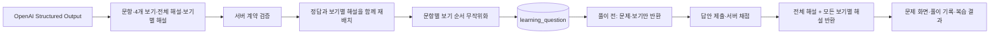

# 퀴즈 정답 분포·보기별 해설 정책

## 해결하려는 문제

생성 모델은 선택지를 만들 때 정답을 첫 번째 항목에 두는 형식적 편향을 보일 수 있습니다. 화면에서 A가 계속 정답이면 학습자는 내용보다 위치를 외우게 되고, 객관식 평가의 신뢰도도 떨어집니다. 또한 정답만 설명하면 오답 선택지가 왜 그럴듯해 보이지만 틀렸는지 학습하기 어렵습니다.

## 생성부터 표시까지의 흐름

## 정답 위치 편향 방지

모델 프롬프트에는 각 문항의 정답 위치를 독립적으로 무작위화하라고 지시합니다. 모델 지시만 신뢰하지 않고 서버도 다음을 처리합니다.

1. 모델 응답의 정답 보기와 해당 보기의 해설을 하나의 쌍으로 유지합니다.
2. 각 문항의 보기 4개를 독립적으로 무작위 순서로 섞습니다.
3. 보기별 해설도 해당 보기와 같은 순서로 이동합니다.

따라서 짧은 퀴즈에서는 우연히 같은 위치가 연속될 수 있지만, 특정 위치를 의도적으로 균등 배정하거나 반복하지 않습니다. 이 처리는 모델을 다시 호출하지 않으므로 토큰 비용을 추가하지 않습니다.

## 보기별 해설 계약

새 문항은 다음 데이터를 생성·저장합니다.

- `explanation`: 문항 전체의 핵심 설명
- `optionExplanations`: 보기 순서와 정확히 같은 길이의 4개 설명

채점 전 `QuizViewResponse`에는 정답·전체 해설·보기별 해설을 넣지 않습니다. 제출 후의 `AttemptResult`, 풀이 기록 상세, 복습 답안 결과에만 반환합니다. 이로써 개발자 도구에서 정답이 사전에 노출되지 않는 기존 경계를 유지합니다.

Flyway V17은 `learning_question.option_explanations` JSON 텍스트 열을 추가합니다. 기존에 저장된 문항은 이 정보가 없으므로 기존 전체 해설만 유지하며, 새로 생성하는 문항부터 모든 보기별 설명을 저장합니다.

## 검증

- `QuizOptionOrderServiceTest`: 모든 보기가 보존되고, 정답 설명이 무작위 재배치 뒤에도 정답 보기와 연결되는지 검증
- `OpenAiQuizServiceTest`: Structured Output 계약에 보기별 해설이 포함되는지 검증
- `LearningWorkflowIntegrationTest`: 제출 응답에서 4개의 보기별 해설을 반환하는지 검증
- 테스트는 OpenAI API를 호출하지 않습니다.
