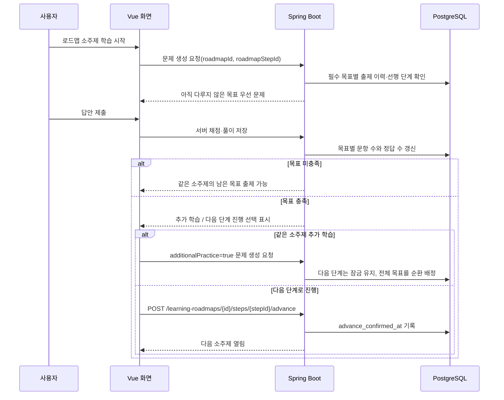

# 로드맵 진행 선택과 Git 학습 노트 구조

## 목적

로드맵 학습의 완료 기준은 “필수 내용을 최소 한 번 다뤘다”는 기준입니다. 목표 문항 수를 모두 풀었다고 바로 다음 소주제로 이동시키면, 사용자가 약한 부분을 더 연습할 기회를 잃습니다. 반대로 추가 연습을 하더라도 다음 단계가 자동으로 열리면 학습 순서를 설명하기 어렵습니다.

그래서 단계형 로드맵은 **목표 충족**과 **다음 단계 진행 확정**을 별도 상태로 관리합니다. 일반 주제 퀴즈에는 적용하지 않고, `roadmapStepId`가 있는 로드맵 학습에만 적용합니다.

## 진행 흐름



## 상태와 서버 규칙

| 상태 | 의미 | 허용 동작 |
| --- | --- | --- |
| `READY` | 선행 단계가 확정되어 아직 풀이가 없음 | 일반 로드맵 문제 생성 |
| `IN_PROGRESS` | 목표 문항을 일부만 풀이함 | 남은 필수 목표 우선 생성 |
| `AWAITING_DECISION` | 목표 문항을 채웠지만 다음 단계 진행을 아직 확정하지 않음 | 같은 소주제 추가 학습 또는 진행 확정 |
| `COMPLETED` | 사용자가 진행을 확정함 | 이후 단계의 선행 조건으로 사용, 해당 단계의 새 문제 생성 차단 |
| `LOCKED` | 선행 단계가 아직 진행 확정되지 않음 | 문제 생성 차단 |

`learning_roadmap_step.advance_confirmed_at`은 사용자가 다음 단계로 넘어가겠다고 선택한 시각입니다. 목표 문항 수를 넘긴 추가 학습량은 진행률을 100% 이상으로 부풀리지 않고 `additionalPracticeQuestions`로 별도 반환합니다. 로드맵 전체 완료도 모든 단계가 `COMPLETED`가 된 뒤에만 처리됩니다.

추가 학습 요청은 이미 끝난 목표를 버리지 않습니다. 필수(`CORE`) 목표를 우선순위로 둔 뒤 전체 목표를 순환 배정해 요청한 문항 수만큼 다시 연습합니다. 모델 호출 여부는 기존과 같습니다. 데모 모드면 비용이 없고, AI 생성 모드에서만 OpenAI 호출 비용이 발생합니다.

## Git 저장 구조

풀이 기록은 PostgreSQL이 원본이며, Git 저장은 사용자가 채점 후 **Git에 저장** 버튼을 눌렀을 때 만드는 사람이 읽기 쉬운 Markdown 사본입니다.

서버는 브라우저가 전송한 제목이나 경로를 저장 위치 결정에 사용하지 않습니다. `quizId`로 저장된 `learning_quiz`를 조회하고 연결된 로드맵·단계 정보를 이용해 경로를 계산합니다.

```text
backend/src/main/resources/saved_quizzes/
└── roadmaps/
    └── roadmap-42-Kubernetes_운영_로드맵/
        ├── Kubernetes_기초/
        │   ├── Pod.md
        │   └── Pod-2.md
        └── Kubernetes_네트워크/
            └── Service.md
```

- 같은 `roadmapId`는 항상 하나의 `roadmap-{id}-{정리된 제목}` 디렉터리에 누적됩니다.
- 단계형 로드맵은 대주제 이름의 하위 디렉터리로 구분하고, 그 안에서 소주제 이름을 Markdown 파일명으로 사용합니다.
- 같은 소주제를 두 번째 이상 저장하면 기존 노트를 덮어쓰지 않고 `소주제-2.md`, `소주제-3.md`처럼 순번을 붙입니다. 소주제가 없는 대주제 단독 단계는 대주제 이름을 파일명으로 사용합니다.
- 일반 퀴즈는 기존 `saved_quizzes/` 최상위 저장 방식을 유지합니다.
- 로드맵 디렉터리에는 DB ID를 포함해 동명이인 로드맵이 섞이지 않게 하고, 파일 생성은 `CREATE_NEW`로 처리해 동시에 저장해도 기존 노트를 덮어쓰지 않게 합니다.

`GitService`는 파일이 아니라 `saved_quizzes` 전체를 `git subtree split` 대상으로 사용합니다. 따라서 한 단계에 새 노트를 저장해도 다른 로드맵·단계 노트가 `notes` 원격에서 사라지지 않습니다. 외부 Git 명령은 로컬 작업 트리에 커밋을 남기고 `notes/main`으로 푸시하므로, Git 저장은 사용자가 버튼으로 명시 실행한 경우에만 발생합니다.

## 목록 관리와 삭제

로드맵 화면은 `진행 중`과 `완료됨` 탭을 분리합니다. 각 탭은 한 목록만 표시하고 항목을 펼쳐 진행률·단계·학습 목표를 확인하는 방식이라, 여러 로드맵을 동시에 만들었을 때도 완료 이력이 현재 학습을 밀어내지 않습니다.

삭제는 `DELETE /api/learning-roadmaps/{roadmapId}`로 처리하며 확인 대화상자에서 영향을 먼저 안내합니다.

- 삭제 대상: `learning_roadmap`, `learning_roadmap_step`, 단계 의존 관계, 학습 목표 같은 **계획 정의**
- 유지 대상: `learning_quiz`, `learning_question`, `learning_attempt`, `learning_attempt_answer`, 복습 이력
- 유지 방법: 외래 키의 `ON DELETE SET NULL`로 퀴즈의 `roadmap_id`, `roadmap_step_id`, `learning_objective_id` 연결만 해제

즉, 잘못 만든 계획은 관리 화면에서 제거할 수 있지만 “내가 언제 어떤 문제를 풀었는가”라는 학습 이력은 삭제되지 않습니다. 이 선택은 삭제 실수로 학습 통계와 복습 근거가 사라지는 일을 막기 위한 것입니다.

## 문제 풀이 화면에서 다음 학습 단위로 이어가기

소주제(또는 소주제가 없는 대주제)의 완료 기준을 채운 뒤 사용자가 `다음 단계로 진행`을 누르면 서버가 해당 단계를 완료로 확정하고 최신 로드맵 요약을 돌려줍니다. 문제 풀이 화면은 이 응답의 첫 `READY`/`IN_PROGRESS` 단계를 찾아 다음 정보를 즉시 보여줍니다.

- 같은 대주제 안의 **새 소주제**인지, 새 대주제의 첫 소주제인지, 소주제가 없는 **새 대주제**인지
- 대주제·소주제 이름과 설명
- 이번 생성에서 다룰 남은 문제 수(한 번에 최대 20개)와 해당 학습 단위의 전체 완료 기준

사용자는 로드맵 관리 화면으로 돌아가지 않고 `바로 시작` 버튼으로 다음 단위의 문제를 생성할 수 있습니다. 이 버튼은 기존 문제 생성 방식을 그대로 사용하므로, AI 생성 모드라면 클릭 시에만 OpenAI 호출 비용이 발생하고 데모 모드에서는 비용이 발생하지 않습니다. 모든 단계를 마쳤다면 다음 단위 대신 완료 안내만 표시합니다.

## 검증 범위

- H2 학습 흐름 테스트: 목표 충족 시 `AWAITING_DECISION`, 일반 생성 거절, `additionalPractice=true` 재배정, 진행 확정 뒤 `COMPLETED` 전환을 검증합니다.
- 프론트 빌드: 로드맵 화면과 제출 뒤 선택 카드가 Vue 컴파일을 통과하는지 확인합니다.
- 실제 Git 원격 푸시는 사용자 저장소를 변경하므로 자동 테스트하지 않습니다. 대신 저장 경로는 서버가 `quizId` 관계에서 계산하며, `saved_quizzes` 밖의 파일은 Git 저장 대상으로 거절합니다.
